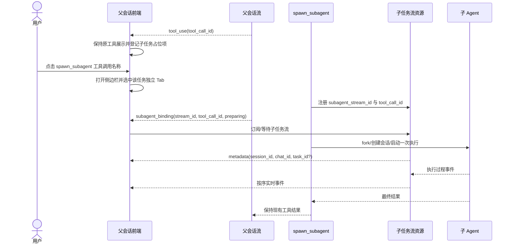

# spawn_subagent 全过程流式输出：需求与功能分析

> 文档状态：待审核
>
> 对应版本：`qwenpaw v1.1.12.post2`
>
> 本阶段范围：需求与功能分析，不包含详细技术方案、开发计划和代码实现

## 1. 文档目的

本文基于当前 `spawn_subagent`、普通会话 SSE、前端会话切换与重连机制，分析“子会话全过程实时流式输出”需求，明确功能边界、标识关系、各运行模式的统一语义、兼容要求和验收标准。

本阶段遵循以下原则：

- 不改变现有 `spawn_subagent` 的调用方式、最终工具结果和任务查询行为。
- 新增流式能力作为旁路能力，避免把子会话事件混入父会话正文流。
- 优先增加独立的数据结构、接口和适配层，尽量减少已有代码改动。
- 前后端通过稳定、版本化的事件契约协作，避免依赖内部类或第三方组件实现细节。
- 不修改 `.venv/Lib/site-packages` 下的 AgentScope、AgentScope Runtime 等第三方包源码。

## 2. 需求背景

当前父会话调用 `spawn_subagent` 后，前端主要能看到以下结果：

- 前台模式：子 Agent 执行完成后，父会话一次性收到最终工具结果。
- 后台模式：父会话先收到后台 `task_id` 和子会话 `session_id`，之后通过 `check_agent_task` 查询最终状态或结果。
- fork 模式：额外创建隔离的子会话状态和可选 Git worktree，但结果呈现方式仍取决于前台或后台模式。

四种 fork/background 组合在子 Agent 正式执行阶段都基于 AgentScope Runtime 的流式 `stream_query` 产生事件；但当前 `spawn_subagent` 前台链路只消费 SSE 并保留最后一个事件，后台链路遍历流式生成器但只保存最终事件。fork 准备阶段本身不产生 Agent 执行流，四种模式目前也都没有把完整过程消息实时暴露给浏览器。

因此会出现以下用户体验和产品能力缺口：

- 子任务执行期间，用户无法在子会话 Tab 中实时了解进度。
- 前台长任务在最终结果返回前缺少可见反馈。
- 后台任务虽然较早返回 `task_id`，但该标识只覆盖后台模式，不能统一表示四种模式的流式执行。
- 已有 `session_id`、`chat_id` 与后台 `task_id` 的生成时机和职责不同，前端缺少一个能够尽早绑定且稳定重连的统一标识。
- 同一父会话并发启动多个子任务时，缺少面向前端的独立流资源和明确关联关系。

## 3. 现状梳理

更完整的已有代码时序见 [subagent-tool-chat-sse.md](./subagent-tool-chat-sse.md)。本节只列出与本需求直接相关的结论。

### 3.1 现有 spawn_subagent 标识与行为

现有调用链中同时存在多类标识：

| 标识 | 当前职责 | 生成或出现时机 | 能否直接作为统一子任务流标识 |
| --- | --- | --- | --- |
| 父会话工具调用 ID（`tool_call_id`） | 关联父会话中的工具调用和工具结果 | 父模型发起工具调用时 | 否。它适合父页面定位，但不是可独立订阅的后端执行资源 |
| 子会话 `session_id` | 标识子 Agent 的会话状态；非 fork 通常由工具生成，fork 时由 fork 接口创建实际值 | fork 与非 fork 的时机不同 | 否。它代表会话状态，不天然等价于某一次运行，也不负责事件游标和缓冲 |
| 子会话 `chat_id` | 标识持久化 ChatSpec/聊天记录 | Runner 处理请求时创建或取得 | 否。出现偏晚，当前也没有注册为该子任务实际运行流的跟踪键 |
| 后台 `task_id` | 标识 AgentScope Runtime 后台任务，供 `check_agent_task` 查询 | 仅 `background=true` 时创建 | 否。前台模式不存在，并且当前任务引擎主要保留最终事件 |
| fork 分支/worktree 信息 | 标识 fork 隔离环境 | fork 初始化期间 | 否。它是执行环境信息，不是消息流资源 |

当前父会话页面的工具卡主要使用模型工具调用 ID 关联调用与结果。现有工具最终输出虽然可能包含子 `session_id`、后台 `task_id` 和 fork 信息，但不包含能够覆盖所有模式、支持事件回放的统一流标识。

### 3.2 现有普通会话 SSE 能力

普通会话后端以真实 `chat_id` 作为运行跟踪键：

1. `/api/console/chat` 解析或创建会话和 ChatSpec。
2. `TaskTracker` 启动一个后台生产者，持续消费 Agent 流并缓存 SSE 数据。
3. 当前连接作为订阅者接收缓存和后续事件。
4. 浏览器断开时只移除订阅者，不取消后台生产者。
5. 前端切回运行中的会话后，以 `reconnect=true` 再次请求，后端按 `chat_id` 附着到已有任务并回放缓存。

现有机制的重要边界：

- 重连缓存位于单进程内存中，进程重启后不能恢复。
- 当前没有基于 SSE `Last-Event-ID` 的增量游标，通常会回放完整缓存，由上层状态重新构造或去重。
- 页面切换造成的断连与显式停止会话是两个不同动作。
- 前端存在临时 SDK 会话 ID、后端 `session_id` 和真实 `chat_id` 三层标识转换。

### 3.3 需求差距

| 能力 | 普通会话现状 | spawn_subagent 现状 | 本需求目标 |
| --- | --- | --- | --- |
| 实时输出 | 支持 | 内部产生但未传到浏览器 | 四种模式全部支持 |
| 早期绑定 | 首次请求后解析真实会话 | 只能等待工具结果或后台任务信息 | 子执行开始前返回可订阅标识 |
| 断连不停止执行 | 支持 | 无浏览器子流 | 支持 |
| 重连与回放 | 进程内支持 | 不支持 | 至少达到普通会话同等级，并具备明确去重语义 |
| 多任务隔离 | 不同 `chat_id` 隔离 | 父页面缺少独立流资源 | 每次 spawn 独立 |
| 最终结果兼容 | 已有行为 | 已有前台/后台行为 | 保持不变 |

## 4. 需求目标与范围

### 4.1 目标

本需求需要实现以下结果：

1. `fork=false/background=false`、`fork=true/background=false`、`fork=false/background=true`、`fork=true/background=true` 四种模式均能实时输出子 Agent 的用户可见执行过程消息。
2. 每一次 `spawn_subagent` 调用都拥有一个独立、稳定、尽早可获得的流式会话标识。
3. 父会话中的具体工具调用能够与对应子任务流建立一一关联。
4. 用户点击父会话中 `spawn_subagent` 工具调用名称时打开子 Agent 侧边栏，并定位到该次调用独立对应的子任务 Tab；Tab 能立即订阅，也能在切换或网络中断后重新连接。
5. 同一父会话内多个并发或串行子任务的事件、状态、回放缓存和终态互不串流。
6. 现有前台工具最终结果、后台 `task_id` 查询、fork 隔离语义和旧前端行为保持兼容。

### 4.2 本阶段功能范围

- 新的子任务流资源及其生命周期。
- 父工具调用与子任务流的早期绑定。
- 子 Agent 用户可见事件的实时传输。
- 订阅、断连、重连、回放和终态语义。
- 四种 spawn 模式下的一致行为。
- 多子任务隔离、权限校验、资源回收和基础可观测要求。
- 父会话工具调用名称、子 Agent 侧边栏和独立子任务 Tab 使用该能力所需的最小功能契约。

### 4.3 暂不纳入本期范围

- 修改子 Agent 的推理、工具选择或任务调度策略。
- 修改现有 `spawn_subagent` 参数语义。
- 用新流接口替换父会话现有工具结果展示。
- 修改 AgentScope/AgentScope Runtime 第三方包源码。
- 跨后端进程重启恢复未完成的流和内存缓冲；本期最低目标与普通会话当前能力一致。
- 新增独立的子任务暂停、恢复、重试或取消产品功能。
- 将模型隐藏思维链、系统提示词、凭据、原始调试日志或底层 HTTP 数据返回前端。
- 递归展示孙级 subagent 的独立 Tab。孙级调用可先作为当前子会话中的普通工具过程展示。

## 5. 核心概念与标识模型

### 5.1 新增逻辑资源：Subagent Stream Run

建议在功能层引入“子任务流运行实例”（下文简称 Stream Run）。它代表“一次 `spawn_subagent` 调用所触发的一次子 Agent 执行及其事件流”，而不是永久会话本身。

每个 Stream Run 使用一个不透明、全局唯一且不可由业务字段推导的 `subagent_stream_id`。该标识应覆盖所有前台、后台、fork 和非 fork 模式。

采用独立标识的原因：

- `tool_call_id` 属于父会话消息协议，适合做绑定键，但不适合直接暴露为后端订阅资源主键。
- `session_id` 代表可复用会话状态，一次会话未来可能发生多次运行，不能天然标识某一次事件序列。
- `chat_id` 在当前调用链中创建较晚，且职责是持久化聊天，不应同时承担早期准备阶段和事件缓冲的全部职责。
- `task_id` 只存在于后台模式，不能统一四种模式。

`subagent_stream_id` 是需求层的逻辑名称。是否复用经验证满足全部约束的现有 ID，或新增专用 ID，将在技术方案阶段确定；对前端应始终表现为稳定、不透明的流资源标识。

### 5.2 标识关联关系

每个 Stream Run 至少需要维护以下逻辑关联：

```text
父 agent_id + 父 chat_id/session_id + tool_call_id
                         │
                         ▼
                subagent_stream_id
                         │
             ┌───────────┼────────────┐
             ▼           ▼            ▼
     子 session_id    子 chat_id   后台 task_id（可选）

             另有关联：fork 分支/worktree（可选）
```

字段在功能上分为两类：

- 创建时必须已知：`subagent_stream_id`、父会话标识、父 `tool_call_id`、fork/background 模式、创建时间、初始状态。
- 准备过程中补全：实际子 `session_id`、子 `chat_id`、后台 `task_id`、fork 分支或 worktree 信息。

其中 `tool_call_id` 是父页面定位工具卡和占位 Tab 的首选键；`subagent_stream_id` 是订阅、重连、回放和隔离的首选键。

### 5.3 唯一性与一一对应要求

- 一次实际 `spawn_subagent` 执行只能对应一个 `subagent_stream_id`。
- 同一个父会话中的不同 `tool_call_id` 必须对应不同 Stream Run。
- 同一个子 `session_id` 若未来被多次运行，每次运行仍应拥有不同的 `subagent_stream_id`。
- 重连、重复查询和同一流的多个订阅者不得创建新的子 Agent 执行。
- 客户端重试父请求时，需依赖既有请求/工具调用幂等边界避免重复创建；具体幂等键在方案阶段确定。

## 6. 功能需求

### FR-01：四种模式统一支持流式输出

所有模式都必须暴露同一类 Stream Run 能力：

| fork | background | 现有父工具行为 | 新增流行为 |
| --- | --- | --- | --- |
| false | false | 父工具调用等待子任务完成，返回最终结果 | 执行期间可通过独立子流实时订阅；最终工具结果保持不变 |
| true | false | 先 fork，再等待子任务完成并返回结果 | 从准备/fork 阶段即可建立流资源；子 Agent 开始输出后实时传输；fork 语义不变 |
| false | true | 较早返回 `task_id`、`session_id`，由 `check_agent_task` 查询 | 在后台任务运行期间持续提供独立子流；原查询方式继续可用 |
| true | true | 先 fork，再创建后台任务并返回任务信息 | 流资源覆盖准备、fork 和后台运行阶段；原 fork 与任务查询方式继续可用 |

新增流仅“旁路观察”同一次子 Agent 执行，不能为了流式展示再次请求 `/api/agent/process`，也不能产生第二份子任务。

### FR-02：早期创建与绑定

后端必须在子 Agent 第一条执行过程消息产生之前创建 Stream Run，并尽早让父会话前端获得绑定信息。

推荐的功能时序如下：



约束如下：

- 绑定消息必须至少包含父 `tool_call_id` 和 `subagent_stream_id`。
- 如果子 `session_id` 或 `chat_id` 尚未创建，可以先返回 `preparing` 状态，随后通过元数据事件补全。
- 在第一条子内容事件之前，必须已经发送能够唯一识别该流的绑定或元数据。
- fork 初始化耗时不能阻塞流标识的创建；前端应能先显示“准备中”。
- 除父流中的主动绑定消息外，还应提供可查询或可恢复的绑定关系，避免前端恰好断连时永久丢失绑定。具体查询接口在方案阶段确定。

### FR-03：父工具调用与子流绑定

父会话必须能把每个 `spawn_subagent` 工具实例绑定到正确的 Stream Run：

- 绑定以父会话范围内的 `tool_call_id` 为直接关联键。
- 用户点击父会话中某个 `spawn_subagent` 工具调用名称时，前端必须依据该调用的 `tool_call_id` 打开侧边栏并选中唯一对应的子任务 Tab。
- 同一工具调用名称被重复点击时必须复用并激活同一个 Tab，不能重复创建子任务或重复创建 Tab。
- 绑定关系同时受当前用户/Agent/父会话权限范围约束，不能仅凭流 ID 越权订阅。
- 父会话最终工具结果可附带新增的结构化流元数据，但原有文本内容和解析方式必须保持兼容。
- 新前端应优先使用结构化绑定事件；最终工具结果或查询接口只作为恢复和兼容补充，不能成为首次实时展示的唯一来源。
- 旧前端不识别新增事件时，应能安全忽略，并继续使用原工具卡和最终结果。

### FR-04：返回全部用户可见执行过程消息

“所有执行过程消息”定义为：普通会话当前能够向用户展示的、由该子 Agent 执行产生的完整事件序列，而不是后端全部内部日志。

应包含：

- 响应开始、进行中、结束等生命周期事件。
- Assistant 文本或内容块的增量输出。
- 按现有产品展示策略允许呈现的 reasoning/thinking 状态或内容。
- 子 Agent 发起的工具调用、工具参数、工具执行状态和工具结果。
- 子 Agent 自身触发的可见系统状态、错误和终止信息。
- 必要的 usage、完成原因等现有普通会话已暴露的元数据。
- Stream Run 自身的 `preparing`、`running`、`completed`、`failed` 等控制状态。

不得包含：

- 模型或框架未授权展示的隐藏思维链。
- 系统提示词、环境变量、访问令牌、Cookie 或其他敏感数据。
- 与用户界面无关的原始运行日志、堆栈噪声和底层 HTTP 分片。
- 其他父会话或其他子任务的事件。

事件内容模型应尽量复用普通会话已有的消息语义，使前端可以复用渲染组件；Stream Run 的控制事件应采用独立命名空间或版本字段，避免污染普通消息协议。

### FR-05：独立子流订阅

子任务过程消息应通过独立于父会话正文流的订阅资源提供：

- 父会话流只负责发送工具调用、早期绑定和原有工具结果。
- 子任务流负责子 Agent 的过程事件、状态、回放和终态。
- 侧边栏和子任务 Tab 是子流的展示容器，不替换、不搬移也不隐藏父会话原有工具调用及工具结果。
- 打开子 Tab 不应建立新的父 Agent 请求。
- 关闭或切换子 Tab 只影响该浏览器订阅者，不影响父流、其他子流或子 Agent 实际执行。
- 一个 Stream Run 可允许同一用户在多个页面或重连请求中订阅；所有订阅者观察同一生产者。

这种职责分离可减少父/子流生命周期耦合，也避免子 Agent 大量事件阻塞父会话主输出。

### FR-06：断连、重连与事件回放

流式接口至少应达到普通会话现有的断连重连能力，并补充明确的事件序列语义：

- 浏览器断开只移除订阅关系，不自动取消子 Agent 执行。
- `subagent_stream_id` 在 Stream Run 生命周期和可回放保留期内保持稳定。
- 每个流内的可回放事件具有单调递增的 `sequence` 或等价事件游标。
- 重连时客户端可声明最后确认的事件位置；后端返回其后的缺失事件并继续推送。若首期选择完整回放，客户端也必须能依据稳定事件 ID 去重。
- 重连不得触发新的子 Agent 执行，不得把另一个子任务的事件附着到当前 Tab。
- 若断连期间任务完成，重连后仍能取得缺失事件和唯一终态。
- 已过期、无权限或不存在的流应返回可区分的结构化错误，不能静默创建新任务。

正常终态后，事件应在一段可配置的保留期内可重放。保留时长、最大事件数、最大字节数和淘汰策略在技术方案中确定。

首期不要求在服务进程重启后恢复内存中的活动流；如果未来要求跨进程或跨实例恢复，需要引入持久化或共享事件存储，属于后续增强。

### FR-07：多子任务隔离

一个父会话可同时存在多个 `spawn_subagent` 调用。每个 Stream Run 必须拥有独立的：

- `subagent_stream_id`。
- 父 `tool_call_id` 绑定。
- 状态机和终态。
- 事件序列、回放缓存和订阅者集合。
- 子 `session_id`、子 `chat_id` 和可选后台 `task_id` 关联。
- 错误、超时和资源回收生命周期。

任意子任务失败、断连、完成或缓存过期，都不能改变其他子任务的流状态。并发写入时仍须保证单个流内有序，不要求不同流之间建立全局顺序。

### FR-08：Stream Run 状态机

功能上建议使用以下状态：

```text
created → preparing → running → completed
                    ↘ failed
                    ↘ cancelled
created/preparing  → failed

completed/failed/cancelled → expired（保留期结束）
```

- `created`：流标识和父工具绑定已建立。
- `preparing`：正在 fork、创建子 session/chat 或启动后台执行。
- `running`：已开始接收子 Agent 执行事件。
- `completed`：子 Agent 正常完成，最终事件已写入。
- `failed`：准备或执行失败，并具有可展示错误。
- `cancelled`：子执行被现有取消机制明确终止；页面断连不属于取消。
- `expired`：可回放数据已回收，不再允许附着。

每个 Stream Run 只能发布一次业务终态。重复底层结束信号应被归并，避免前端重复结束。

### FR-09：准备阶段和异常处理

异常在任何阶段发生时，都必须落到已经绑定的 Stream Run 上：

- 注册流失败：不得启动子 Agent，并由父工具调用按现有错误方式返回。
- fork 或子会话创建失败：流发布 `failed` 终态，父工具仍按现有错误语义结束。
- 前端在子 `chat_id` 尚未就绪时订阅：连接可等待或先收到 `preparing`，不能返回错误后要求轮询猜测。
- 子执行中途失败：先发送可展示错误，再发送唯一 `failed` 终态；前台/后台原结果行为保持一致。
- SSE 连接中断：生产者继续运行，事件进入该流缓存。
- 后台任务查询与流状态暂时不一致时：两者最终状态必须收敛，且可通过关联 ID 排查。
- 服务器无法继续保留事件时：应明确告知流已过期或回放窗口不足，不能把不完整回放伪装成完整结果。

### FR-10：子 Agent 侧边栏与独立子任务 Tab

本需求明确以下交互和展示语义；侧边栏尺寸、位置、动效等具体视觉设计留待方案阶段：

1. 父会话收到 `spawn_subagent` 工具调用后，以 `tool_call_id` 登记子任务占位项，但保持当前工具调用卡片、调用参数、执行状态和工具结果的原有展示。
2. `spawn_subagent` 工具调用名称新增点击交互；用户点击后打开子 Agent 侧边栏，并选中该次工具调用唯一对应的子任务 Tab。
3. 每一次 `spawn_subagent` 工具调用对应且只对应一个独立 Tab。多个子任务各自拥有独立 Tab，不得复用同一个消息容器。
4. 绑定尚未到达时，Tab 可以先显示 `preparing` 占位状态；收到绑定事件后，将占位项绑定到 `subagent_stream_id` 并立即订阅子流。
5. 重复点击同一个工具调用名称，只重新打开侧边栏或激活已有 Tab；不得创建重复 Tab、重复订阅状态或新的子 Agent 执行。
6. 收到元数据更新后，在同一个 Tab 上补全子 `session_id`、`chat_id`、后台 `task_id` 和 fork 信息。
7. 使用普通会话可复用的消息组件，在对应 Tab 内逐步渲染该子 Agent 的内容、工具过程、错误和终态。
8. 切换到其他子任务 Tab 时，可断开原 Tab 的网络订阅但保留其界面状态；切回时携带该 Tab 自己的流 ID 和游标重连。Tab 切换不得取消子任务。
9. 关闭侧边栏只关闭展示区域，不删除 Tab 状态、不取消父会话或子任务；再次点击工具调用名称可恢复并定位到对应 Tab。
10. 同一父会话多个子 Tab 分别保存自己的 `tool_call_id`、流 ID、游标、消息状态和终态。
11. 页面刷新后，可从父会话历史或绑定查询能力恢复仍在运行或保留期内的 Stream Run，并重建工具调用到 Tab 的对应关系。
12. 若新流能力不可用，仍保留现有通用工具卡和最终工具结果展示作为降级路径；点击入口可显示明确的不可用状态，但不得影响父工具结果。

`subagent_stream_id` 与子 `chat_id` 必须作为两个概念保留：前者定位一次实时执行，后者用于会话记录和页面路由。前端可以在子 `chat_id` 就绪后更新路由或 Tab 元数据，但不能因此更换正在订阅的流资源。

父会话和侧边栏是并存关系：父会话继续展示原有 `spawn_subagent` 调用及返回结果，侧边栏只新增对同一子任务全过程消息的查看入口。

### FR-11：现有行为兼容

新增能力不得改变以下行为：

- `spawn_subagent` 现有参数、默认值和四种模式选择。
- 父会话中 `spawn_subagent` 工具调用及工具结果的内容、状态、位置和既有渲染方式；本期只为工具调用名称增加打开侧边栏的交互能力。
- 前台模式等待完成并返回最终 `ToolResponse` 的语义。
- 后台模式较早返回 `task_id`，以及 `check_agent_task` 的查询方式和结果语义。
- fork 会话复制、分支/worktree 建立和清理逻辑。
- 父会话原有 SSE 消息和普通会话的断连重连机制。
- 不支持新协议的旧前端仍能完成工具调用并看到最终工具结果。
- 子流订阅失败不能反向导致子 Agent 执行失败；流注册这一必要步骤失败时除外。

新增字段或事件必须向后兼容：旧消费者可忽略，新消费者不应依赖解析现有工具结果中的自然语言文本来获得关键绑定。

### FR-12：查询与恢复绑定

除实时绑定事件外，系统还需要提供按权限恢复绑定关系的能力，以覆盖以下情况：

- 父页面在绑定事件到达时已经断连。
- 页面刷新后只有父 `chat_id` 和历史工具调用 ID。
- 子 Tab 已保存 `subagent_stream_id`，需要取得当前状态和已补全的子会话元数据。

功能上至少支持以下一种或组合方式：

- 按父 `chat_id` 查询其 Stream Run 列表。
- 按父 `chat_id + tool_call_id` 查询单个绑定。
- 按 `subagent_stream_id` 查询状态和关联元数据。

查询结果不能泄露事件正文或其他用户的子任务，并应区分“尚未就绪”“已结束但可回放”“已过期”和“不存在”。

## 7. 事件契约的功能要求

详细 JSON/SSE 格式留待技术方案阶段确定，但事件协议至少满足以下约束：

### 7.1 公共元数据

每条可独立处理的事件或其所在连接上下文应明确以下信息：

- 协议版本。
- `subagent_stream_id`。
- 单流内事件 ID/序号。
- 事件类型和产生时间。
- 当前状态或内容载荷。

绑定和元数据事件还需包含父 `tool_call_id`，并在可用时包含子 `session_id`、子 `chat_id`、后台 `task_id` 和 fork 信息。

### 7.2 顺序与投递语义

- 保证同一 Stream Run 内按产生顺序投递。
- 允许重连场景至少一次投递，因此事件必须可去重。
- 不承诺不同 Stream Run 间的全局顺序。
- 控制事件和内容事件共享可判断的顺序边界，避免先显示内容、后知道其属于哪个任务。
- 终态事件之后不得再出现新的业务内容事件；心跳或连接关闭信号除外。

### 7.3 心跳与空闲

长时间无模型输出时，接口应具备连接保活或可检测的心跳机制。心跳不进入业务事件历史，也不推进业务消息游标，避免回放缓存被无意义占用。

## 8. 非功能需求

### NFR-01：最小侵入与低耦合

- 优先以 QwenPaw 自有的流注册、广播、绑定和路由适配层实现。
- 不直接修改第三方 site-packages。
- 子流能力与父会话工具结果解耦；禁用该能力时现有流程仍可运行。
- 前端复用普通消息渲染模型，但不把子任务生命周期强耦合到普通 Chat 页面的临时 ID 转换逻辑。

### NFR-02：执行唯一性

广播、重连、多个订阅者和查询操作必须只观察既有执行。任何订阅操作都不得调用实际 Agent 处理入口创建第二次执行。

### NFR-03：性能与资源边界

- 事件传输不得显著增加子 Agent 首 token 延迟。
- 慢订阅者不能无限阻塞子 Agent 生产者。
- 每个流的缓存大小、事件数量、持续时间和终态保留期必须有上限。
- 超限策略需可观测，并向客户端给出明确的回放不完整或流过期状态。
- 多个子任务并发时，资源配额按用户、父会话或 Agent 维度可控制。

### NFR-04：安全与权限

- 创建、订阅、查询和重连都必须校验当前 Agent/用户对父会话和子会话的访问权限。
- 流 ID 必须不可预测，不能以枚举方式访问他人任务。
- 事件沿用现有消息内容安全策略和工具结果脱敏策略。
- 日志中不得记录完整敏感消息正文；诊断应优先记录关联 ID、状态和计数。

### NFR-05：可观测性

后端日志和指标应可通过以下标识串联一次执行：

```text
parent_chat_id / tool_call_id / subagent_stream_id /
child_session_id / child_chat_id / background_task_id
```

至少应观察：活动流数、订阅者数、断连/重连次数、事件数、缓存字节数、首事件耗时、完成耗时、失败阶段、过期和回放缺口。

### NFR-06：可测试性

流注册、事件追加、回放、状态迁移和权限判断应可独立测试；四种模式的端到端测试不得依赖页面人工观察才能判断结果。

## 9. 验收标准

### 9.1 四种模式

对四种 fork/background 组合分别执行包含文本输出和至少一次工具调用的子任务，均满足：

- 父会话在第一条子内容事件前获得 `tool_call_id → subagent_stream_id` 绑定。
- 子 Tab 能按顺序看到文本增量、子工具调用、工具结果和终态。
- 实际子 Agent 只执行一次。
- 前台最终工具结果与改造前一致；后台 `task_id` 与 `check_agent_task` 行为与改造前一致。
- fork 模式的子会话、分支/worktree 行为与改造前一致。

### 9.2 早期绑定

- 人为延迟 fork 或 ChatSpec 创建时，前端仍能先取得流 ID 并显示 `preparing`。
- 子 `session_id`、`chat_id` 就绪后，元数据能补全到同一个流，不创建第二个 Tab。
- 绑定事件丢失或页面刷新后，可以通过恢复接口重新得到正确映射。

### 9.3 侧边栏与工具展示兼容

- 改造前后的父会话对比中，`spawn_subagent` 工具调用参数、运行状态和最终工具结果内容保持一致，没有被子流内容替换、搬移或隐藏。
- 点击某个 `spawn_subagent` 工具调用名称会打开子 Agent 侧边栏，并激活该 `tool_call_id` 唯一对应的 Tab。
- 在绑定信息尚未就绪时点击，侧边栏显示该任务的 `preparing` 占位 Tab；绑定完成后在同一个 Tab 内开始输出，不出现第二个 Tab。
- 重复点击同一个调用名称只激活已有 Tab；点击另一个调用名称则切换或创建其独立 Tab。
- 关闭侧边栏后子任务继续执行；再次点击时能够恢复对应 Tab，并通过已有状态或重连补齐过程消息。
- 子流失败或不可用时，父会话原有工具结果仍然正常展示。

### 9.4 多任务独立

同一父会话同时启动至少两个内容可明显区分的子任务：

- 两者具有不同的 `tool_call_id` 和 `subagent_stream_id`。
- 两个 Tab 只出现各自事件，序号和状态分别维护。
- 断开、重连、失败或完成其中一个，不影响另一个。
- 任一后台 `task_id`、子 `session_id`、子 `chat_id` 都映射到正确流。

### 9.5 断连与重连

- 在事件序号 N 后主动断开，子任务继续执行。
- 携带流 ID 和游标重连后，能取得 N 之后的全部可回放事件，并继续实时接收。
- 完整回放实现下，前端依据稳定事件 ID 去重后，最终界面不存在缺失或重复内容。
- 断连期间任务完成时，重连仍能取得剩余消息和唯一终态。
- 对不存在、无权限和已过期流分别返回明确结果，不启动新任务。

### 9.6 兼容与降级

- 不启用子流 UI 或使用旧前端时，父会话工具卡和最终结果仍正常。
- 子流网络连接失败时，父工具调用和子 Agent 执行不受影响，并仍可通过原有最终结果或后台查询获知结果。
- 普通会话 SSE 的发送、切换、断连重连和停止功能回归通过。
- 未修改 `.venv/Lib/site-packages` 下的第三方源码。

### 9.7 资源和安全

- 终态流在配置的保留期后被回收，并返回明确过期状态。
- 慢客户端和多订阅者不会无限增加内存或阻塞子 Agent。
- 使用其他用户、Agent 或父会话的身份订阅流会被拒绝。
- 日志可通过关联 ID 定位问题，但不泄露敏感消息正文。

## 10. 对后续技术方案的约束

技术方案必须证明以下事项，而不能只描述接口：

1. 在当前工具调用链中，最早能可靠取得父 `tool_call_id` 的位置，以及如何无歧义传入 `spawn_subagent` 绑定逻辑。
2. 如何在不重复执行子 Agent 的前提下，把现有内部 async stream 分发给最终结果收集器、后台任务机制和浏览器订阅者。
3. fork 模式下如何先创建流资源，再补全实际 `session_id` 和 `chat_id`。
4. 子 `chat_id` 的创建和 ChatManager/TaskTracker 注册如何避免与当前随机 `ext-*` 跟踪键冲突。
5. 选择独立 Stream Tracker、扩展现有 TaskTracker 或其他方式的理由，以及对普通会话的影响面。
6. SSE 路由、事件格式、游标、缓存上限、过期和权限模型。
7. 父会话绑定事件如何进入现有消息协议，旧前端为何能够安全忽略。
8. 前端如何在现有 SDK fetch/AbortController、会话 ID 转换和工具卡适配器基础上最小增量接入。
9. 如何在不改变现有工具调用和结果展示的前提下，只为 `spawn_subagent` 工具调用名称增加侧边栏入口，并稳定维护 `tool_call_id → Tab → subagent_stream_id` 映射。
10. 前台、后台、fork、异常、断连和并发场景的自动化验证方案。
11. 所有必须修改的已有文件及修改原因，并优先给出新增文件/新增类方案。

## 11. 待审核决策项

以下内容建议在本需求文档审核时确认，确认后再进入详细设计：

| 决策项 | 建议 | 影响 |
| --- | --- | --- |
| 是否采用独立 `subagent_stream_id` | 是 | 可统一四种模式，并与 session/chat/task 职责解耦 |
| 首次绑定方式 | 父 SSE 主动发送结构化绑定事件，同时提供查询恢复 | 满足实时性并覆盖断连/刷新 |
| 子过程流承载方式 | 独立订阅流 | 降低父子生命周期和带宽耦合 |
| 重连游标 | 单流单调序号或稳定事件 ID | 支持增量回放或可靠去重 |
| 终态保留 | 配置化短期保留 | 支持断连后取回完整结果，同时控制内存 |
| 跨进程重启恢复 | 本期不要求 | 与普通会话当前内存级保障一致，后续可扩展共享存储 |
| reasoning/thinking 展示 | 完全遵循普通会话当前可见策略 | 避免泄露隐藏思维链 |
| 子任务独立取消 | 本期不新增产品能力 | 先保持现有任务语义，避免扩大修改范围 |
| 孙级 subagent 独立 Tab | 本期不要求 | 控制首期范围；仍可作为子会话工具过程展示 |
| 旧工具结果 | 保持原文本/结构兼容，可追加可忽略元数据 | 避免影响现有调用方和旧前端 |
| 侧边栏入口 | 点击父会话 `spawn_subagent` 工具调用名称 | 保留原工具展示，以最小交互增量打开对应子任务 |
| Tab 唯一性 | 每次工具调用一个独立 Tab，重复点击复用 | 保证多个子任务独立且不重复执行 |

## 12. 代码依据

本分析主要依据以下现有实现：

- `src/qwenpaw/agents/tools/agent_management.py`：`spawn_subagent` 四种模式、子 session 生成、前台流最终结果收集和后台任务创建。
- `src/qwenpaw/app/routers/fork.py`：fork 子会话与 worktree 创建。
- `src/qwenpaw/app/runner/runner.py`、`manager.py`、`api.py`：ChatSpec 创建、Agent 请求处理和运行状态管理。
- `src/qwenpaw/app/_app.py`：AgentScope Runtime AgentApp 路由装配。
- `src/qwenpaw/app/routers/console.py`：普通会话 SSE 请求、重连和停止入口。
- `src/qwenpaw/app/channels/console/channel.py`：普通会话事件向 SSE 的转换。
- `src/qwenpaw/app/runner/task_tracker.py`：普通会话流的后台生产、广播、缓存和重连附着。
- `console/src/pages/Chat/index.tsx`：前端流请求、AbortController、重连和真实会话解析。
- `console/src/pages/Chat/sessionApi/index.ts`、`components/ChatSessionInitializer/index.tsx`：会话状态与页面初始化。
- `console/src/components/Chat/ToolCards/adapters/v1Adapter.tsx`：工具调用 ID 和通用工具卡适配。
- `.venv/Lib/site-packages/agentscope_runtime/engine/app/agent_app.py`：`/agent/process` 与 `/agent/process/task` 行为。
- `.venv/Lib/site-packages/agentscope_runtime/engine/deployers/utils/service_utils/routing/task_engine_mixin.py`：后台任务流消费与最终事件保存。
- `console/node_modules/@agentscope-ai/chat`：前端 SDK 的流读取、会话切换中止和消息状态处理。

## 13. 审核结论入口

本阶段建议确认以下结论后再进入方案设计：

1. 将“一次 spawn 执行”抽象为独立 Stream Run，并使用统一的不透明流 ID。
2. 父工具调用先产生占位项，后端在第一条子内容前主动发送绑定。
3. 子过程消息走独立流，父工具原有最终返回完全保留。
4. 断连不停止执行，重连按稳定游标回放，同一流永不重复启动 Agent。
5. 四种模式共享同一事件和状态语义，多子任务严格隔离。
6. 首期重连保障与普通会话保持同级，不包含服务进程重启恢复。
7. 实现优先新增 QwenPaw 自有组件，不修改第三方包，修改范围以最小闭环为限。

审核通过后，下一阶段再输出详细技术方案，包括接口协议、类与模块边界、精确代码改动点、兼容策略和异常时序。
