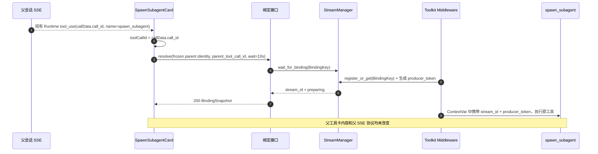
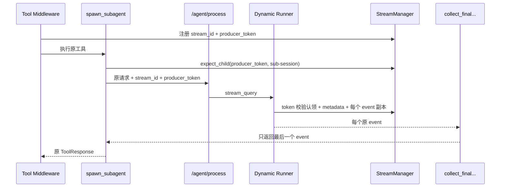
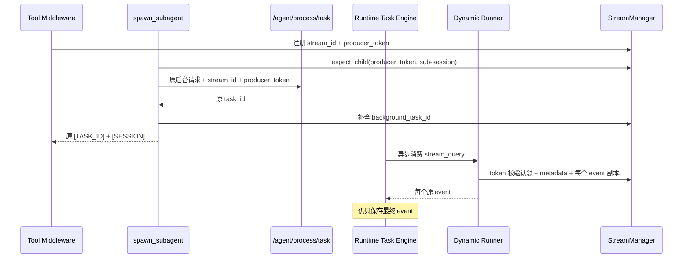
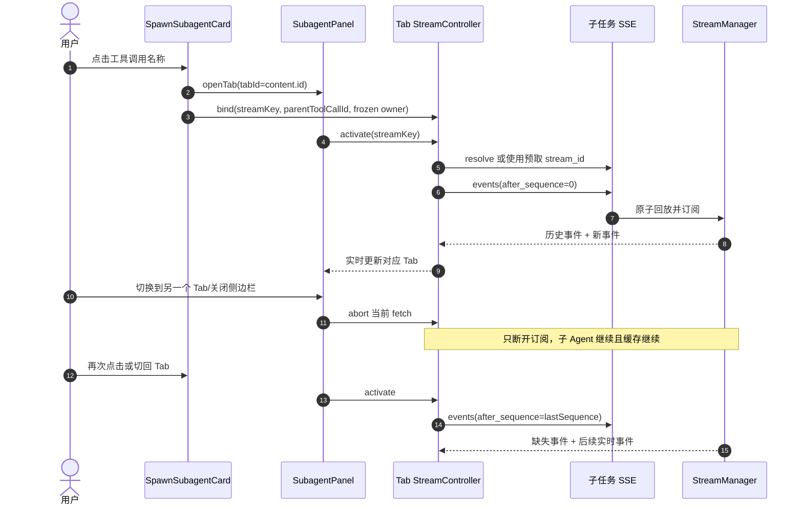

# spawn_subagent 全过程流式输出：方案设计分析

> 文档状态：已审核通过（2026-07-23，自审补充内部凭据剥离、SDK 构建期校验和嵌套工具无副作用渲染约束）
>
> 对应版本：`qwenpaw v1.1.12.post2`
>
> 前置文档：[1需求与功能分析.md](./1需求与功能分析.md)
>
> 本次修订：确认新增独立 `SubagentStreamManager`、不复用 `TaskTracker`，并修正真实工具 ID、三层标识、Runtime 渲染上下文、Runner 故障隔离、生产者凭据及前端复合键设计
>
> 本阶段范围：方案设计分析，不包含代码实现和详细开发/测试计划

## 1. 设计结论

推荐采用“独立子任务流管理器 + 现有 `stream_query` 旁路复制 + 前端按工具调用主动解析绑定”的方案。

核心结论如下：

1. 每次实际执行的 `spawn_subagent` 注册一个独立 `subagent_stream_id`，以 Runtime 工具消息 `content[0].data.call_id` 对应的真实父 `parent_tool_call_id` 作为后端绑定键。
2. 不修改 AgentScope、AgentScope Runtime 第三方源码。
3. 不为流式展示再次执行子 Agent；只在 QwenPaw 的 `DynamicMultiAgentRunner.stream_query` 外层复制同一批事件。
4. 前台模式仍由现有 `collect_final_agent_chat_response` 读取最后一个事件，后台模式仍由 Runtime Task Engine 保存最终事件。
5. 不向父会话 SSE 注入新的消息类型，也不在现有工具结果文本中追加流 ID；前端看到 `spawn_subagent` 工具调用后，通过独立绑定接口尽早取得流 ID。
6. 父会话现有 `SpawnSubagentCard`、工具状态、`[SESSION]`、`[TASK_ID]` 和最终结果展示保持不变。
7. 复用当前已有的 `SpawnSubagentCard`、`SubagentPanel` 和 `subagentPanelStore`；新增流客户端和流状态存储，只替换侧边栏内部“轮询后展示历史”的主数据来源。
8. 子任务流使用独立的事件缓存、序号和订阅队列，支持页面切换、关闭侧边栏和网络断开后的增量回放。
9. 新流能力内部故障时采用 fail-open：记录错误并退回当前轮询/历史展示，不阻断原有 `spawn_subagent` 执行和工具结果。
10. 明确新增独立 `SubagentStreamManager`，不复用、不扩展普通会话 `TaskTracker`；后者继续只负责现有普通会话运行、重连和热重载等待。
11. 前端现有 `content.id` 只继续作为 UI Tab ID；新增可选 `toolCallId` 保存真实 `call_id`，绑定 ID、Tab ID 和 Stream ID 不再混用。
12. Runner 旁路默认使用 `NullObserver`，任何观察器初始化、序列化、发布或结束异常都不得进入原 `stream_query` 的异常分支。

## 2. 当前实现基础

### 2.1 后端可复用能力

- `spawn_subagent` 的四种模式最终都进入 `/api/agent/process` 或 `/api/agent/process/task`。
- 两个入口最终都消费 `DynamicMultiAgentRunner.stream_query`。
- 前台链路逐行读取 SSE，但只把最后一个事件转成工具结果。
- 后台链路遍历 `stream_query`，但 AgentScope Runtime Task Engine 只保存最终事件。
- 子 ChatSpec 在 `AgentRunner.query_handler` 中通过 `ChatManager.get_or_create_chat` 创建。
- 普通会话 `TaskTracker` 已验证“生产者与浏览器订阅者分离”能够实现断连不停止执行。

### 2.2 前端已有能力

当前分支已经存在以下 UI，不需要重新建设：

- `SpawnSubagentCard.tsx`：`spawn_subagent` 专用工具卡。
- `ToolCardShell.onTitleClick`：工具调用名称的点击扩展点。
- `subagentPanelStore.ts`：以现有 `content.id` 作为 UI Tab ID；该字段当前不等同于 Runtime 的真实工具调用 ID。
- `SubagentPanel`：右侧栏和多个独立 Tab。
- 后台任务轮询：Tab 通过 `task_id` 查询最终状态。
- 完成后历史加载：按子 `session_id` 查找 ChatSpec，再加载聊天历史。

当前 `console/src/components/Chat/ToolCards/adapters/v1Adapter.tsx` 读取 `callData.id/data.id` 生成 `content.id`；后端 `src/qwenpaw/app/runner/utils.py` 则通过 `FunctionCall(call_id=block.id)` 把真实工具调用 ID放入 Runtime `callData.call_id`。因此改造必须以新增可选字段的方式补齐 `toolCallId = callData.call_id`，不能把现有 `content.id` 整体替换为 `call_id`，避免改变已有工具卡和 Tab 行为。

因此本方案不是新增另一套侧边栏，而是将现有侧边栏升级为：

```text
当前：点击工具名称 → 独立 Tab → 等待/轮询 → 完成后加载历史

目标：点击工具名称 → 独立 Tab → 绑定 stream_id → 实时流式渲染
                                      └→ 失败时保留原轮询/历史降级
```

### 2.3 为什么不能直接复用普通 TaskTracker

普通 `TaskTracker` 不适合作为本功能的直接实现：

- 普通运行以 `chat_id` 为键，而 `spawn_subagent` 需要在子 `chat_id` 创建前完成绑定。
- 当前子请求在 `DynamicMultiAgentRunner` 中只登记随机 `ext-*` 运行键。
- `TaskTracker.register_external_task` 只登记运行状态，不接收和广播事件。
- 普通 `TaskTracker` 在生产者结束后立即删除运行和 buffer，不能支持子 Tab 在任务结束后短时间回放。
- 直接扩展现有 `TaskTracker` 会改变普通会话核心路径，影响面大于新增专用管理器。

本方案参考其生产者/订阅者分离思想，但新增独立 `SubagentStreamManager`，不改变普通会话行为。

## 3. 方案选型

### 3.1 候选方案对比

| 方案 | 优点 | 问题 | 结论 |
| --- | --- | --- | --- |
| 修改 AgentScope Runtime Task Engine 保存所有事件 | 后台入口直接可取事件 | 修改第三方；只覆盖后台；升级风险高 | 不采用 |
| 将子事件混入父会话 SSE | 前端无需第二条连接 | 父子流强耦合；可能影响 SDK；多个子任务事件混杂；父结果展示风险高 | 不采用 |
| 使用子 `chat_id` 直接接普通会话 reconnect | 看似可复用现有接口 | `chat_id` 生成晚；当前不是活动运行键；完成后 buffer 被删除 | 不采用 |
| 再请求一次 `/agent/process` 给侧边栏 | 实现表面简单 | 会重复执行子任务，语义错误 | 禁止采用 |
| 新建流管理器，在 QwenPaw Runner 外层旁路复制 | 四种模式统一；不改第三方；不重复执行；可独立回放 | 需要新增绑定、缓存和订阅接口 | 推荐 |

### 3.2 绑定方式选型

可选的早期绑定方式有三种：

1. 在现有工具结果文本中追加流 ID：前台模式返回太晚，而且会改变父工具结果展示。
2. 向父会话 SSE 注入新的 `subagent_binding` 事件：绑定最主动，但需要改变父 SSE 协议和现有 SDK 消费边界。
3. 父前端收到现有 `tool_use` 后，从 Runtime 消息的 `callData.call_id` 取得真实 `parent_tool_call_id` 并调用绑定解析接口：不改变父 SSE 和工具结果，可通过短长轮询覆盖“工具卡先出现、后端流稍后注册”的毫秒级竞态。

本方案选择第 3 种。

它仍满足“尽早绑定”：父会话原本就会先收到包含真实 `call_id` 的工具调用；V1 适配器把它增量映射为 `ToolCallContent.toolCallId`，前端在该工具卡渲染时立即预取绑定，后端在真正进入 `spawn_subagent` 函数前注册流资源。若前端请求略早，绑定接口等待注册完成后立即返回。若消息中不存在真实 `call_id`，前端不得使用 `content.id` 或 `Date.now()` 生成值请求绑定，只能沿用现有轮询/历史降级。

选择这一方式的主要原因是：父会话 SSE、普通会话 `TaskTracker`、父工具结果内容和旧前端都无需改变。

## 4. 总体架构

```mermaid
flowchart LR
    ParentUI[父会话现有工具卡] -->|parent_tool_call_id 预取/点击| Resolve[绑定解析接口]
    Resolve --> Manager[SubagentStreamManager]
    Card[SpawnSubagentCard] --> Panel[现有 SubagentPanel]
    Panel --> Client[SubagentStreamClient]
    Client -->|stream_id + after_sequence| SSE[子任务 SSE 接口]
    SSE --> Manager

    ToolCall[Toolkit 调用中间件] -->|注册绑定| Manager
    ToolCall --> Spawn[现有 spawn_subagent]
    Spawn -->|request_context 携带 stream_id + producer_token| Runtime[/agent/process 或 /task]
    Runtime --> Dynamic[DynamicMultiAgentRunner]
    Dynamic -->|原事件继续 yield| Existing[现有最终结果收集器/Task Engine]
    Dynamic -->|事件副本| Manager
    Manager --> SSE
```

架构被划分为四个相互独立的职责层：

- 工具绑定层：在工具真正执行前取得真实父 `parent_tool_call_id` 并注册 Stream Run。
- 事件采集层：从现有 `stream_query` 旁路复制事件，不改变原事件对象和原消费者。
- 流管理层：维护标识、状态、事件序号、缓存、订阅和保留期。
- 前端展示层：解析绑定、管理每个 Tab 的连接和游标，复用现有 Runtime 消息渲染能力。

## 5. 标识与数据模型

### 5.1 标识关系

```text
UI Tab ID
  = 现有 content.id
  └─ 只用于现有 SubagentPanel 的 Tab 创建、激活和去重

BindingKey
  = agent_id
  + parent_session_id
  + parent_user_id
  + parent_channel
  + parent_tool_call_id

BindingKey 1:1 subagent_stream_id

subagent_stream_id 1:1 本次子 Agent 执行
  ├─ child_session_id
  ├─ child_chat_id
  ├─ background_task_id（仅后台）
  ├─ fork/worktree 元数据（仅 fork）
  └─ 独立事件序列和订阅者集合
```

三层标识必须严格分离：

- `tab_id = content.id`：保持现有 UI 行为，不作为后端绑定凭据。
- `parent_tool_call_id = content.toolCallId = callData.call_id`：真实工具调用 ID，只用于父调用与子流绑定。
- `subagent_stream_id`：绑定成功后由后端生成的独立流 ID，只用于订阅对应 Stream Run。

不使用父 `chat_id` 作为注册必填项，原因是工具执行上下文当前稳定提供的是父 `session_id/user_id/channel/agent_id`。这些字段与真实 `parent_tool_call_id` 组成的复合键足以在当前 ChatManager 作用域内唯一定位调用。

前端若已经具有父 `chat_id`，可把它作为附加校验和可观测字段传给绑定接口，但不能用它替代父 `session_id`。

### 5.2 Stream Run 模型

建议新增内部模型 `SubagentStreamRun`：

| 字段 | 类型 | 说明 |
| --- | --- | --- |
| `stream_id` | string | `substream-<uuid>`，不透明且不可预测 |
| `agent_id` | string | 父子共用的 Agent 作用域 |
| `parent_session_id` | string | 父 Agent session |
| `parent_user_id` | string | 父会话用户 |
| `parent_channel` | string | 父会话渠道 |
| `parent_tool_call_id` | string | Runtime `callData.call_id`，父调用与子流的稳定绑定键，不等同于 UI Tab ID |
| `fork` | bool | 本次工具参数快照 |
| `background` | bool | 本次工具参数快照 |
| `status` | enum | `preparing/running/completed/failed/cancelled/expired` |
| `expected_child_session_id` | string? | 内部生产者认领校验，不对前端提前暴露 |
| `child_session_id` | string? | 子请求被实际认领后对外提供 |
| `child_chat_id` | string? | ChatSpec 创建后补全 |
| `background_task_id` | string? | Runtime 后台任务 ID |
| `fork_branch` | string? | fork 分支信息 |
| `worktree_path` | string? | 仅后端诊断使用，默认不直接返回前端完整路径 |
| `producer_token_digest` | string | 一次性生产者凭据摘要；原 token 不持久化到响应、日志或前端状态 |
| `producer_claimed` | bool | 保证只绑定一次真实子执行 |
| `next_sequence` | int | 下一事件序号 |
| `first_available_sequence` | int | 当前缓存最早可回放序号 |
| `events` | deque | 有界事件缓存 |
| `subscribers` | map | 每个连接独立的有界队列 |
| `created_at/started_at/finished_at/expires_at` | datetime | 生命周期时间 |
| `last_error` | object? | 脱敏后的流错误摘要 |

### 5.3 状态迁移

```text
preparing
  ├─ 子请求认领成功 → running
  ├─ fork/提交失败 → failed
  └─ 原工具被取消 → cancelled

running
  ├─ Runtime completed → completed
  ├─ Runtime failed/error → failed
  └─ Runtime cancelled → cancelled

completed/failed/cancelled
  └─ 保留期结束 → expired/tombstone → 删除
```

注册时直接使用 `preparing`，不额外保留对前端无价值的瞬时 `created` 状态。

状态迁移必须幂等：终态之后重复收到完成或异常信号，只记录诊断信息，不新增第二个终态事件。

## 6. 最早绑定设计

### 6.1 获取真实父 parent_tool_call_id

`spawn_subagent` 函数签名当前只有业务参数，不能从参数中取得工具调用 ID。前端 Runtime 消息中的真实 ID 位于 `content[0].data.call_id`；后端同源 ID 是 AgentScope Toolkit `ToolUseBlock.id`。可靠的最早后端位置是 AgentScope Toolkit 的工具调用中间件：

- Toolkit middleware 的 `kwargs["tool_call"]` 同时包含工具名称、输入参数和真实 `id`。
- 中间件发生在工具函数调用前。
- AgentScope Toolkit 是第三方能力，但中间件实现和注册代码放在 QwenPaw 自有模块中，不修改第三方包。

建议新增 `register_subagent_stream_middleware(toolkit)`：

1. 非 `spawn_subagent` 工具直接调用 `next_handler`，不产生额外行为。
2. 对 `spawn_subagent` 读取 `tool_call.id`、`fork` 和 `background`。
3. 从现有 `agent_context` 读取父 `agent_id/session_id/user_id/channel`。
4. 调用 `SubagentStreamManager.register_or_get` 注册 Stream Run，同时生成高熵、一次性的 `producer_token`；对外 Snapshot 不包含该 token。
5. 将 `stream_id + producer_token` 组成的内部上下文写入新的 `ContextVar`，再执行原工具函数。
6. 在 `finally` 中恢复 ContextVar，保证并行工具调用互不污染。

`ContextVar` 适合当前实现，因为 AgentScope 可并行执行多个工具调用，而 Python 会为每个异步任务维护独立上下文。

### 6.2 中间件注册点

在 `QwenPawAgent._create_toolkit` 创建 `Toolkit()` 后注册一次中间件。只需一处已有代码接入，不改 `_acting`、ToolGuard 和各工具调用逻辑。

如果流注册器异常，中间件记录日志、保持 ContextVar 为空并继续执行 `next_handler`。这保证新增功能故障不会阻断原工具。

### 6.3 前端绑定解析

现有 `SpawnSubagentCard` 已取得 `content.id`，但它只能继续作为 UI Tab ID。设计对共享 `ToolCallContent` 增加可选 `toolCallId`，由 V1 适配器严格读取 `callData.call_id`，再增加一个无界面副作用的预取动作：

- 工具卡处于 `calling` 状态且 `content.toolCallId` 有效时，以该真实 ID 和当前父会话身份调用绑定解析接口。
- `content.toolCallId` 缺失时不允许回退到 `content.id` 或合成 ID，请求不发出并沿用原轮询/历史逻辑。
- 解析结果写入新增的 `subagentStreamStore`，使用 `agent_id + parent_session_id + parent_tool_call_id` 复合键，不自动打开侧边栏。
- 用户点击工具名称时仍调用现有 `openTab`；对应流若已经预取完成可立即订阅。
- 用户点击早于绑定完成时，Tab 显示 `preparing`，解析请求保持短等待或按退避重试。
- 已完成的历史工具卡不批量预取；只在用户点击时解析，避免页面加载产生大量请求。
- Controller 在创建时复制并冻结 owner 与复合键；异步 resolve、重连和事件处理不得再次读取可能已经切换的全局当前会话。

### 6.4 早期绑定时序



## 7. 子请求上下文传播

### 7.1 内部请求字段

`spawn_subagent` 从 ContextVar 读取当前 `stream_id + producer_token`，在构造子 AgentRequest 时向 `request_context` 加入 QwenPaw 保留字段：

```json
{
  "request_context": {
    "_qwenpaw_subagent_stream_id": "substream-...",
    "_qwenpaw_subagent_producer_token": "仅内部传递且不回传前端的高熵随机值",
    "fork_project_dir": "仅 fork 模式已有字段"
  }
}
```

该字段只用于 QwenPaw Runner 外层识别事件归属：

- 不加入模型提示词。
- 不加入现有父工具结果。
- 不要求 AgentScope Runtime 理解。
- 不改变 AgentRequest 的 `stream` 和其他既有参数。
- `producer_token` 不写入绑定响应、SSE、日志、前端 Store 或 Chat 历史。
- Dynamic Runner 完成生产者认领后，必须从本次请求的 `request_context` 副本中删除 `_qwenpaw_subagent_producer_token` 和 `_qwenpaw_subagent_stream_id`，再委托实际 `workspace.runner.stream_query`；子 `QwenPawAgent._request_context`、工具和插件不能继续取得这两个内部字段。

### 7.2 生产者认领

仅凭前端可知的 `stream_id/agent_id/child_session_id` 不能允许任意 `/agent/process` 请求向流写入事件。因此注册时必须生成不回传前端的 `producer_token`；在实际发送子请求前，`spawn_subagent` 还需要调用管理器登记预期子 `session_id`。

`DynamicMultiAgentRunner` 收到子请求时，使用以下字段原子认领生产者：

```text
stream_id + producer_token + agent_id + expected_child_session_id
```

约束：

- 每个 Stream Run 只允许一次生产者认领。
- token、session 或 agent 任一不匹配时，不向该流写入任何内容，但原 Agent 请求仍继续。
- 管理器只保存 `producer_token` 的安全摘要并使用恒定时间比较；原 token 用后即从局部上下文释放。
- `producer_token` 永不通过任何前端接口返回；`expected_child_session_id` 在认领前同样不通过绑定接口返回。
- fork 模式在 fork API 返回实际 `fork_session_id` 后、发送子请求前更新预期值。

### 7.3 元数据补全

元数据按以下时机补全：

| 字段 | 补全位置 |
| --- | --- |
| `stream_id/parent_tool_call_id/fork/background` | Toolkit middleware 注册时 |
| `producer_token` | Toolkit middleware 注册时生成；仅经 ContextVar 和子请求 `request_context` 内部传递 |
| 预期子 `session_id` | `spawn_subagent` 生成非 fork session，或 fork API 返回实际 session 后 |
| 对外子 `session_id` | Runner 成功认领生产者时 |
| 子 `chat_id` | Runner 收到首个事件前，通过 `workspace.chat_manager` 按子 session 查询 |
| `background_task_id` | `/agent/process/task` 返回提交结果后 |
| fork 分支信息 | fork API 返回后 |

为了保证元数据先于内容，Runner 取得第一个 Runtime 事件后先解析子 ChatSpec，并先写入 metadata 事件，再写入该 Runtime 事件。

## 8. 事件旁路复制设计

### 8.1 采集点

唯一采集点放在 `DynamicMultiAgentRunner.stream_query`：

```text
workspace.runner.stream_query(request)
       │
       ├─ 原 event ──> yield ──> /agent/process 或 Runtime Task Engine
       │
       └─ event 的 JSON 副本 ──> SubagentStreamManager.publish_runtime_event
```

该位置覆盖：

- 非 fork 前台。
- fork 前台。
- 非 fork 后台。
- fork 后台。

采集逻辑只在 `request_context` 同时存在合法流 ID、合法生产者 token 且生产者认领成功时启用。Observer Factory 读取并认领后创建清理过的 `request_context` 副本，移除两个内部字段再交给实际 Runner。任何字段缺失或认领失败都返回默认 `NullObserver`；即使客户端伪造了内部字段，也要先从请求副本剥离，普通 `/agent/process` 请求随后继续走原路径。

### 8.2 不修改原事件

旁路逻辑必须序列化事件副本，不得：

- 给原 Event 对象增加字段。
- 修改 `status/output/content`。
- 提前消费或重新创建 async generator。
- 改变原 `yield` 次数和顺序。

推荐序列化优先级与 AgentApp 保持一致：

1. `model_dump(mode="json")`。
2. `dict()`。
3. 已经是字典时复制。
4. 不可识别类型转换为脱敏错误事件，但原事件仍照常 yield。

管理器的 append 和队列广播只做有界内存操作。Runner await 安全观察器以保持严格顺序，但慢客户端不会被 await，因为订阅队列使用 `put_nowait`；队列满时只让该订阅者断开重连，不阻塞生产者。

### 8.3 NullObserver 与核心路径故障隔离

`DynamicMultiAgentRunner.stream_query` 是普通会话和四种 subagent 模式共同经过的核心路径。接入必须采用“默认空观察器 + 局部安全包装”而不是把新逻辑直接放入原异常边界：

```text
observer = NullObserver
尝试按 request_context 创建 SafeSubagentObserver
  └─ 失败：记录日志，observer 仍为 NullObserver

async for original_event in runner.stream_query(...):
  尝试 observer.observe(original_event 的副本)
    └─ 失败：仅将子流标记为不可观察，后续退化为 NullObserver
  yield original_event

尝试 observer.finish(...)
  └─ 失败：只记录日志
```

强制约束：

- `NullObserver.observe/finish/fail` 为无副作用 no-op。
- observer 初始化、生产者认领、事件复制、序列化、publish、complete/fail 的每一步都在独立 `try/except` 内。
- observer 异常不得逃逸到现有 `DynamicMultiAgentRunner.stream_query` 外层 `except`，不得触发原有 error event，也不得提前结束原 generator。
- 内部 request context 清理使用请求级浅拷贝，只删除本功能的两个保留字段；不得修改 `fork_project_dir`、root session 或其他现有上下文字段。
- 观察器只读取并复制原事件，不能修改、替换或延迟持有原事件对象。
- 单个事件复制或序列化失败时，只向子流记录脱敏错误或关闭该观察能力；原事件仍按原次数和顺序 yield。
- 任何订阅者网络速度、队列状态和重连行为都不能反压 `stream_query`。

### 8.4 完成和异常

- Runtime response 的 `completed` 状态到达后，先保存原 Runtime 事件，再追加 Stream Run `completed` 控制事件。
- Runtime response/message 明确为 `failed/canceled/rejected` 时，映射为对应终态。
- Runner 抛出异常时，管理器追加脱敏 error 和 `failed`；原有异常处理继续执行。
- 若 generator 正常结束但没有明确终态，在 `finally` 中用 `completed` 补齐一次。
- 旁路管理器自身异常由 Safe Observer 吞掉并记录日志，不影响原 event 的 yield，也不改变原 Runner 异常处理。

### 8.5 子 chat_id 获取

不修改 `AgentRunner.query_handler` 的 ChatSpec 创建代码。旁路观察器在第一个事件写入前使用：

```text
workspace.chat_manager.get_chat_id_by_session(
    child_session_id,
    child_channel,
)
```

子 session 是随机且本次执行唯一，能够稳定反查 ChatSpec。若第一次查询尚未可见，在后续事件前重试；`child_chat_id` 补全后不再查询。

这种方式避免为了取得 `chat_id` 重排 Runner 的现有初始化顺序。

## 9. 四种模式设计

### 9.1 统一处理矩阵

| fork | background | 流注册 | 子事件采集 | 原父工具结果 |
| --- | --- | --- | --- | --- |
| false | false | 工具函数前 | `/agent/process` 的同一 `stream_query` | 完成后原样返回 `[SESSION] + 文本` |
| true | false | fork 开始前 | fork 成功后 `/agent/process` 的同一流 | 原样返回 session、文本和可能的 branch 信息 |
| false | true | 工具函数前 | `/agent/process/task` 内部消费的同一流 | 原样立即返回 `[TASK_ID] + [SESSION]` |
| true | true | fork 开始前 | fork 成功后后台 Task Engine 消费的同一流 | 原样返回 task/session/branch 信息 |

### 9.2 非 fork 前台



### 9.3 fork 前台

与非 fork 前台相比，仅增加准备阶段：

1. Stream Run 已注册，前端可显示 `preparing`。
2. 原 `_call_fork_api` 创建实际 fork session/worktree。
3. 更新预期子 session 和 fork 元数据。
4. 继续走相同 `/agent/process` 旁路采集。
5. 原 worktree 清理和最终结果格式完全保留。

fork API 失败时，流发布 `failed`，父工具仍返回当前 `ERROR: fork API failed...` 文本。

### 9.4 非 fork 后台



后台工具函数完成不等于 Stream Run 完成。Stream Run 终态只能由实际子 `stream_query` 决定。

### 9.5 fork 后台

组合 fork 准备阶段和后台时序：流在 fork 前注册，fork 成功后补全 session/branch，再提交原后台任务。现有“后台 worktree 不自动清理”的语义不变。

## 10. 后端接口设计

建议新增独立路由前缀 `/api/subagent-streams`。由于需要请求体、Agent header 和 AbortController，SSE 继续使用 `fetch + POST`，不使用原生 `EventSource`。

### 10.1 解析工具绑定

```http
POST /api/subagent-streams/resolve
X-Agent-Id: <agent_id>
Content-Type: application/json
```

请求：

```json
{
  "parent_session_id": "parent-session",
  "parent_chat_id": "optional-chat-uuid",
  "user_id": "console-user",
  "channel": "console",
  "parent_tool_call_id": "call_xxx",
  "wait_ms": 10000
}
```

成功响应 `200`：

```json
{
  "schema_version": 1,
  "stream_id": "substream-2b6d...",
  "parent_tool_call_id": "call_xxx",
  "status": "preparing",
  "fork": false,
  "background": false,
  "child_session_id": null,
  "child_chat_id": null,
  "background_task_id": null,
  "first_available_sequence": 1,
  "latest_sequence": 1,
  "created_at": "2026-07-23T00:00:00Z",
  "finished_at": null
}
```

若 `wait_ms` 内尚未注册，返回 `202`：

```json
{
  "schema_version": 1,
  "status": "pending",
  "retry_after_ms": 500
}
```

服务端将 `wait_ms` 限制在 0～10000ms，避免请求长期占用资源。

### 10.2 查询 Stream Run 元数据

```http
POST /api/subagent-streams/{stream_id}/metadata
```

请求体携带与 resolve 相同的父身份字段。响应为最新 BindingSnapshot，不包含事件正文。该接口用于页面恢复、诊断和 SSE 结束后的状态确认。

### 10.3 订阅和重连

```http
POST /api/subagent-streams/{stream_id}/events
Accept: text/event-stream
X-Agent-Id: <agent_id>
Content-Type: application/json
```

请求：

```json
{
  "parent_session_id": "parent-session",
  "user_id": "console-user",
  "channel": "console",
  "after_sequence": 28
}
```

首次连接传 `after_sequence=0`；重连传该 Tab 已确认的最后序号。也可兼容读取 `Last-Event-ID`，但请求体字段优先，便于当前 fetch 客户端明确管理。

响应头：

```text
Content-Type: text/event-stream
Cache-Control: no-cache
Connection: keep-alive
X-Accel-Buffering: no
```

### 10.4 SSE 事件格式

控制事件：

```text
id: 1
event: metadata
data: {"schema_version":1,"stream_id":"substream-...","sequence":1,"kind":"metadata","status":"preparing","payload":{"parent_tool_call_id":"call_xxx"}}

```

Runtime 事件：

```text
id: 3
event: runtime
data: {"schema_version":1,"stream_id":"substream-...","sequence":3,"kind":"runtime","status":"running","payload":{"object":"message","type":"message","...":"原 Runtime event"}}

```

终态事件：

```text
id: 81
event: status
data: {"schema_version":1,"stream_id":"substream-...","sequence":81,"kind":"status","status":"completed","payload":{}}

```

心跳使用 SSE comment：

```text
: ping

```

心跳不进入事件缓存、不占用 sequence。

### 10.5 接口错误

| HTTP 状态 | code | 含义 |
| --- | --- | --- |
| 400 | `invalid_request` | 字段或游标非法 |
| 403 | `stream_forbidden` | Agent/父 session/user/channel 不匹配 |
| 404 | `stream_not_found` | 从未存在的流 |
| 409 | `replay_window_missed` | 请求游标早于当前最早缓存事件 |
| 410 | `stream_expired` | 流曾存在但已过保留期 |
| 429 | `too_many_subscribers` | 单流订阅者超过上限 |

任何错误都不得隐式创建新的子 Agent 请求。

## 11. SubagentStreamManager 设计

### 11.1 建议接口

```python
class SubagentStreamManager:
    async def register_or_get(binding) -> InternalStreamHandle: ...
    async def expect_child(
        stream_id,
        producer_token,
        agent_id,
        session_id,
        **metadata,
    ): ...
    async def claim_producer(
        stream_id,
        producer_token,
        agent_id,
        session_id,
    ) -> Observer: ...
    async def update_metadata(stream_id, **metadata) -> None: ...
    async def publish_runtime_event(stream_id, payload) -> int: ...
    async def complete(stream_id) -> None: ...
    async def fail(stream_id, public_error) -> None: ...
    async def wait_for_binding(binding_key, timeout) -> StreamSnapshot | None: ...
    async def subscribe(stream_id, owner, after_sequence) -> Subscription: ...
    async def detach(stream_id, subscriber_id) -> None: ...
```

这只是模块契约，不要求实现阶段使用完全相同的方法名。

`InternalStreamHandle` 可同时包含 `StreamSnapshot` 与只供后端使用的原始 `producer_token`；所有 Router/API schema 只能序列化公开的 `StreamSnapshot`，从类型边界阻止 token 被意外返回。

### 11.2 原子订阅算法

订阅必须在同一把管理器锁内完成以下步骤：

1. 校验 Stream Run、权限和游标窗口。
2. 取出所有 `sequence > after_sequence` 的缓存事件。
3. 创建订阅队列。
4. 将订阅者加入 Run。
5. 释放锁。

这样可避免“读取历史后、加入实时队列前”产生事件丢失。

### 11.3 单流有序、多流独立

- 每个 Run 独立维护 `next_sequence`。
- append、状态迁移和广播在管理器锁保护下完成。
- 不建立跨流全局顺序。
- 两个 `spawn_subagent` 即使共用父 session，也只能通过各自真实 `parent_tool_call_id/stream_id` 访问各自事件。

### 11.4 缓存和资源默认值

建议首期使用可配置常量：

| 参数 | 建议初值 |
| --- | --- |
| 终态回放保留期 | 10 分钟 |
| 单流最大事件数 | 10000 |
| 单流最大序列化字节 | 16 MiB |
| 单订阅队列长度 | 256 条 |
| 单流最大订阅者 | 4 |
| 全局保留事件预算 | 128 MiB |
| SSE 心跳间隔 | 15 秒 |
| resolve 最大等待 | 10 秒 |

达到全局预算时先按 LRU 淘汰已终态流。活动流达到单流上限时不取消 Agent，而是移动 `first_available_sequence` 并记录 `buffer_truncated` 控制状态；请求过旧游标的客户端收到 `409`，不能静默显示不完整回放。

慢订阅者队列满时只断开该订阅者。其 Tab 使用最后确认序号重新连接并从主缓存补齐，不阻塞生产者。

### 11.5 终态保留与 tombstone

- 终态流在 10 分钟内允许完整或窗口内回放。
- 保留期结束后删除事件正文，但短期保留无正文 tombstone，用于返回 `410` 而不是误报 `404`。
- tombstone 不包含子消息内容、worktree 路径或错误堆栈。
- 本期不持久化到磁盘或 Redis，进程重启后活动流和 tombstone 均丢失，与普通会话当前内存级重连边界一致。

## 12. 前端设计

### 12.1 保持现有工具卡展示

`SpawnSubagentCard` 当前已经通过 `ToolCardShell.onTitleClick` 打开侧边栏。实现阶段必须保持其现有 JSX 展示语义：

- 标题、图标、loading/error 状态不变。
- 现有 `sessionId` inline result 不变。
- 不显示 `subagent_stream_id`。
- 不把子过程消息嵌入父工具卡。
- 不改变 `extractSubagentResultRefs` 对 `[SESSION]` 和 `[TASK_ID]` 的兼容解析。

只增加两个无展示副作用的动作：

1. 运行中的工具卡仅在存在真实 `content.toolCallId` 时预取 `parent_tool_call_id → stream_id`。
2. 点击时向流控制器登记并冻结当前父会话 owner，然后执行现有 `openTab`。

### 12.2 Tab ID、绑定 ID 与 Stream ID

继续使用现有 `SubagentTab.id = content.id` 作为纯 UI Tab ID，不改变 `subagentPanelStore` 的现有行为：

- `tabId = content.id`：工具卡一出现即可创建或打开 Tab；同一现有工具卡重复点击仍命中同一个 Tab。
- `parentToolCallId = content.toolCallId = callData.call_id`：只用于后端 resolve 的真实父工具绑定。
- `streamId`：绑定成功后记录在新流状态中，只用于订阅对应 Stream Run。

三个 ID 不互相覆盖，也不在绑定完成后迁移 Tab key。不得把 `content.id`、`data.id` 或 `Date.now()` 合成值当作 `parentToolCallId`；真实 `call_id` 缺失时，该 Tab 只能使用原轮询/历史降级。

### 12.3 新增 subagentStreamStore

现有 `subagentPanelStore` 继续只管理侧边栏 UI。新增 `subagentStreamStore`，以 `agent_id + parent_session_id + parent_tool_call_id` 组成不可变复合键保存传输状态；不能只按 `tool_call_id` 或当前活动会话存储：

| 字段 | 说明 |
| --- | --- |
| `tabId` | 现有 `content.id`，仅用于定位 UI Tab |
| `parentToolCallId` | 来自 `callData.call_id` 的真实绑定 ID |
| `owner` | Controller 创建时冻结的 agent、父 session/user/channel/chat |
| `streamKey` | `agent_id + parent_session_id + parent_tool_call_id` 复合键 |
| `streamId` | 解析后的流 ID |
| `bindingStatus` | `idle/resolving/resolved/unavailable` |
| `transportStatus` | `disconnected/connecting/streaming/reconnecting/completed/failed` |
| `lastSequence` | 当前已处理游标 |
| `snapshot` | child session/chat/task 和 Stream Run 状态 |
| `response` | 本地 Runtime Builder 适配器合并后的界面模型 |
| `error` | 可展示的传输或流错误 |
| `replayMissed` | 是否发生回放窗口缺口 |

AbortController 和 Builder 实例放在模块级 Controller Map 中，不写入 Zustand，避免不可序列化对象触发无意义渲染。

### 12.4 流控制器

建议新增 `SubagentStreamController`，每个 `streamKey` 一实例。构造函数一次性接收并复制 owner、`tabId` 和 `parentToolCallId`；后续异步任务不得重新读取 `sessionApi.getSessionIdentity()`、window 全局变量或当前路由会话：

```text
resolveBinding()
connect(afterSequence)
handleEnvelope()
scheduleReconnect()
disconnect(reason)
dispose()
```

事件处理规则：

1. `sequence <= lastSequence`：重复事件，忽略。
2. `sequence == lastSequence + 1`：正常处理并推进游标。
3. `sequence > lastSequence + 1`：检测到缺口，中止当前连接并从旧游标重连。
4. `kind=runtime`：把 `payload` 交给本地 Runtime Builder 适配器。
5. `kind=metadata/status`：更新 Tab 元数据和状态。
6. 收到终态：停止自动重连，保留合并后的消息。

活动连接异常时使用 `500ms → 1s → 2s → 5s` 的有上限退避；只要 Tab 仍处于活动显示状态且 Run 未终态，就继续重连。

### 12.5 Runtime 消息合并和渲染

子流事件与普通会话来自同一 `stream_query`，应复用 AgentScope Runtime 的响应合并语义，避免自行拼接文本导致工具调用、reasoning 或 content delta 丢失。

`SubagentPanel` 当前位于 `AgentScopeRuntimeWebUI` 组件外部，而 SDK Runtime ResponseCard 依赖内部 Options Context。侧边栏不能直接挂载 SDK ResponseCard 或现有 `HostResponseCard`，否则可能缺少自定义工具渲染、媒体 URL 处理、主题选项等上下文。

建议新增独立 `SubagentRuntimeResponseView`，并在一个本地适配文件中封装 `AgentScopeRuntimeResponseBuilder`：

- 适配器只接收解包后的原 Runtime payload。
- Builder 实例按 Tab 独立，不能跨 Tab 共用。
- `SubagentRuntimeResponseView` 在 QwenPaw 自有组件中显式渲染 message、tool、reasoning、error 和受支持的媒体内容，不依赖 `AgentScopeRuntimeWebUI` 内部 Context。
- 工具内容通过现有 QwenPaw ToolCards V1 适配/注册能力或等价本地组件渲染；缺少专用卡片时使用 Generic ToolCard，不丢弃执行消息。
- 子流中的嵌套 `spawn_subagent` 工具消息首期固定使用无绑定副作用的 Generic ToolCard，不复用会预取父级绑定和操作全局 Tab 的 `SpawnSubagentCard`，避免用错父会话 owner；本期不自动创建第二层侧边栏。
- 只有 Builder 允许通过一个适配文件使用 SDK 深层 import；ResponseCard、Options Context 等内部组件不直接用于侧边栏。
- 当前 `console/package.json` 声明的是 `@agentscope-ai/chat: ^1.1.68`，不是固定 `==1.1.68`；当前 `console/package-lock.json` 实际锁定 1.1.68。文档和测试必须按这一事实描述。
- 编译测试和最小 Runtime 事件合并测试覆盖该适配器；SDK 升级时只需调整这一处。

当前项目的 `HostBubbles.tsx` 已存在 SDK 深层 import，因此本方案接受“单文件隔离的 Builder 深层 import”，但不修改 `console/node_modules`。如果未来该静态 import 路径不可用，`tsc/vite build` 必须失败并阻止发布；只有运行期事件处理或渲染异常才由 ErrorBoundary 回退现有历史视图。不能把静态模块缺失描述为可在浏览器运行时自动降级。

### 12.6 侧边栏连接生命周期



首期只保持当前可见 Tab 的网络连接：

- 非活动 Tab 保留 Builder 状态和游标，但断开 fetch。
- 切回时增量重连。
- 关闭侧边栏等价于所有 Tab 暂停订阅，不等价于取消任务。
- 关闭单个 Tab 只清理该 Tab 的前端 Controller；后端 Run 按自身保留期继续存在。

### 12.7 当前轮询/历史逻辑的保留

现有 `SubagentPanel` 逻辑不立即删除，作为降级路径：

- 绑定接口不可用时，后台任务继续使用 `task_id` 轮询。
- 子流完成但发生 `replay_window_missed` 时，使用 `child_chat_id` 或现有 `session_id → chat_id` 查询加载持久化历史。
- 进程重启导致流丢失时，任务完成后仍可展示持久化历史。
- 现有 Refresh 按钮保留。

正常情况下以实时流为主，不同时启动高频任务轮询；只有绑定超时、流接口错误或回放缺口时才启用原逻辑。

## 13. 父会话展示不变的保证

本方案通过以下边界保证父会话无回归：

1. `spawn_subagent` 函数参数不变。
2. 前台 `ToolResponse` 内容不变。
3. 后台 `[TASK_ID]`、`[SESSION]` 文本不变。
4. fork branch/worktree 文本不变。
5. 父会话 SSE 不增加自定义事件。
6. 普通 `/api/console/chat`、TaskTracker、stop/reconnect 不变。
7. `SpawnSubagentCard` 可见 JSX 不变。
8. 侧边栏数据加载失败不改变父工具卡状态。
9. 旁路发布失败不抛回原 Runner。
10. 新前端连接子流只读，不调用 Agent 执行入口。

因此旧前端、禁用新流客户端的前端和非 console 渠道仍按原方式工作。

## 14. 异常与竞态设计

### 14.1 工具卡先出现，流尚未注册

- resolve 请求短等待最多 10 秒。
- 点击后 Tab 先显示 `preparing`。
- 返回 `202` 后前端以 500ms 起步退避重试。
- 工具已失败且始终没有绑定时，沿用父工具结果展示，不创建伪流。

### 14.2 fork 失败

- Stream Run 已存在，因此发布明确 `failed`。
- Tab 展示错误。
- 父工具结果仍使用当前 fork 错误文本。

### 14.3 后台任务提交成功但 Runner 尚未启动

- 流保持 `preparing`。
- `background_task_id` 可先补全。
- Runner 认领后切换 `running`。

### 14.4 后台任务完成早于前端绑定

- 管理器从运行开始就缓存事件，不要求先有订阅者。
- resolve 返回终态 snapshot。
- events 从序号 0 回放后关闭连接。

### 14.5 网络断开与 Tab 切换

- AbortController 只终止浏览器 fetch。
- SSE route 的 `finally` 只 detach subscriber。
- Stream Run 生产者不由订阅路由持有，因此继续运行。

### 14.6 重复点击和重复订阅

- UI Tab 仍以现有 `content.id` 去重，不改变 `subagentPanelStore` 行为。
- 流 Controller 以 `agent_id + parent_session_id + parent_tool_call_id` 复合键去重，不依赖 UI Tab ID。
- `register_or_get` 以 BindingKey 幂等。
- 同一个 Run 可以有多个订阅者，但每个订阅者都有自己的队列和游标。
- 订阅永远不能启动 Agent。

### 14.7 父会话中多个并发 subagent

- 并行 Toolkit 中间件各自拥有独立 ContextVar token。
- 每个工具调用注册独立 Stream Run。
- 子请求携带不同 stream ID、producer token 和预期 session。
- 事件采集按 stream ID 分发，不以“当前父会话最近任务”之类的全局变量判断。

### 14.8 流管理器内部异常

- 注册失败：原工具照常执行，侧边栏走旧逻辑。
- 元数据更新失败：记录关联 ID，原请求继续。
- 单个事件序列化失败：流发布脱敏错误或跳过该副本，原事件继续 yield。
- 缓存/订阅异常：只影响子流观察能力，不改变 Agent 结果。
- Safe Observer 任一步骤失败后退化为 `NullObserver`；异常不允许进入原 `DynamicMultiAgentRunner.stream_query` 的外层异常处理。

## 15. 安全设计

- `stream_id` 使用 UUID，不能由 tool/session/task ID推导。
- resolve 必须匹配 `agent_id + parent_session_id + user_id + channel + parent_tool_call_id`，且该 ID 必须来自真实 Runtime `callData.call_id`。
- events 和 metadata 接口再次校验同一 owner，不因已知 stream ID跳过权限检查。
- 若请求提供 `parent_chat_id`，后端通过 ChatManager 校验其 session/user/channel 与绑定一致。
- 生产者使用 `stream_id + producer_token + agent_id + expected_child_session_id` 原子认领；前三个公开或半公开标识不能替代 producer token。
- `producer_token` 只存在于 Toolkit middleware、ContextVar、子请求 `request_context` 和管理器摘要校验过程中，禁止写入响应、SSE、日志、前端状态及持久化 Chat 数据。
- worktree 绝对路径不作为默认前端元数据返回。
- error 事件只返回可展示错误，不返回完整堆栈、请求上下文或凭据。
- Runtime payload 沿用普通会话当前的内容可见性和脱敏规则。
- API 使用现有认证中间件和 `X-Agent-Id` 作用域，不新增绕过认证的公开路由。

## 16. 可观测性

每次状态日志统一包含：

```text
agent_id
parent_session_id
parent_tool_call_id
subagent_stream_id
child_session_id
child_chat_id
background_task_id
```

建议指标：

- `subagent_stream_active_runs`
- `subagent_stream_retained_runs`
- `subagent_stream_events_total`
- `subagent_stream_buffer_bytes`
- `subagent_stream_subscribers`
- `subagent_stream_resolve_wait_seconds`
- `subagent_stream_reconnect_total`
- `subagent_stream_replay_missed_total`
- `subagent_stream_publish_error_total`

日志不记录完整事件 payload，只记录类型、序号、字节数和状态。

## 17. 预计代码边界

### 17.1 优先新增文件

后端建议新增：

| 文件 | 职责 |
| --- | --- |
| `src/qwenpaw/app/subagent_stream/models.py` | Run、Event、BindingKey 和 API schema |
| `src/qwenpaw/app/subagent_stream/manager.py` | 注册、缓存、订阅、回放、终态和回收 |
| `src/qwenpaw/app/subagent_stream/context.py` | ContextVar、Toolkit middleware 和请求上下文辅助函数 |
| `src/qwenpaw/app/subagent_stream/observer.py` | `NullObserver`、Safe Observer、Runner 事件序列化、生产者认领和状态映射 |
| `src/qwenpaw/app/subagent_stream/router.py` | resolve、metadata、events SSE 接口 |
| `src/qwenpaw/app/subagent_stream/__init__.py` | 最小公共导出和 manager provider |

前端建议新增：

| 文件 | 职责 |
| --- | --- |
| `console/src/api/modules/subagentStream.ts` | 绑定、元数据和 SSE fetch |
| `console/src/stores/subagentStreamStore.ts` | 按 agent + 父 session + 真实 parent_tool_call_id 复合键保存流状态 |
| `console/src/pages/Chat/components/SubagentPanel/SubagentStreamView.tsx` | 单 Tab 实时视图 |
| `console/src/pages/Chat/components/SubagentPanel/subagentStreamController.ts` | 连接、重连、游标和 Builder 生命周期 |
| `console/src/pages/Chat/components/SubagentPanel/runtimeAdapter.ts` | 单点隔离 SDK Runtime Builder 深层 import |
| `console/src/pages/Chat/components/SubagentPanel/SubagentRuntimeResponseView.tsx` | 不依赖 AgentScopeRuntimeWebUI Context 的本地消息/工具/reasoning/error 渲染 |

### 17.2 必须最小修改的已有文件

| 文件 | 最小修改 | 不允许改变的部分 |
| --- | --- | --- |
| `src/qwenpaw/agents/react_agent.py` | Toolkit 创建后注册中间件 | 工具清单、ToolGuard、Agent 迭代逻辑 |
| `src/qwenpaw/agents/tools/agent_management.py` | 注入内部 stream context、登记预期 session/task/fork 失败 | 函数签名、模式分支、timeout、最终 ToolResponse 文本 |
| `src/qwenpaw/app/_app.py` | `DynamicMultiAgentRunner.stream_query` 调用 observer 复制事件 | 原 workspace 选择、原 yield、ext task 登记和异常行为 |
| `src/qwenpaw/app/routers/__init__.py` | include 新 router | 其他路由注册顺序和前缀 |
| `console/src/components/Chat/ToolCards/shared/types.ts` | 为 `ToolCallContent` 新增可选 `toolCallId` | 现有 `id` 含义及所有既有必填字段 |
| `console/src/components/Chat/ToolCards/adapters/v1Adapter.tsx` | 将 `callData.call_id` 增量映射到 `toolCallId` | 现有 `content.id` 计算和其他工具卡适配行为 |
| `console/src/components/Chat/ToolCards/cards/SpawnSubagentCard.tsx` | 预取绑定、点击时登记 owner | 可见标题、图标、状态、结果和现有 openTab 行为 |
| `console/src/pages/Chat/components/SubagentPanel/index.tsx` | 正常路径使用新 StreamView，保留旧 fallback | 侧边栏布局、Tab 唯一性和关闭语义 |
| i18n 与样式文件 | 新增 preparing/reconnecting/replay 错误文案和流视图样式 | 现有 key 和布局行为 |

以下文件原则上不修改：

- `src/qwenpaw/app/runner/task_tracker.py`
- `src/qwenpaw/app/routers/console.py`
- `src/qwenpaw/app/channels/console/channel.py`
- `console/src/components/Chat/ToolCards/shared/ToolCardShell.tsx`
- `console/src/stores/subagentPanelStore.ts`；Tab 继续使用原 `content.id`，流映射由新增 Store 独立维护
- `.venv/Lib/site-packages/**`
- `console/node_modules/**`

## 18. 兼容与发布策略

### 18.1 后端兼容

- 新 request_context 字段是可选的；没有字段时 Runner 完全走旧路径。
- request_context 中的生产者 token 是内部字段，不进入任何公开 API schema。
- 新路由独立，不覆盖现有 `/agent/process`、`/task`、`/console/chat`。
- 新管理器不替换 Runtime Task Engine。
- 新管理器不复用、不扩展普通会话 `TaskTracker`。
- Stream Run 不参与原任务取消和 worktree 生命周期。

### 18.2 前端兼容

- resolve 或 events 接口不存在时，Panel 回退当前任务轮询和完成后历史加载。
- `ToolCallContent.toolCallId` 是新增可选字段；`content.id` 的生成和 UI 用法保持不变。
- 真实 `toolCallId` 缺失时不尝试后端绑定，不使用合成 ID，直接保留现有降级行为。
- 历史父消息仍依赖原 `[SESSION]`、`[TASK_ID]` 解析，不要求迁移旧数据。
- 未识别的新流状态不能影响父工具卡 status。
- SDK Builder 深层 import 只位于适配层；侧边栏不直接复用依赖 Options Context 的 Runtime ResponseCard。静态路径失效由构建门禁阻止发布，运行期合并/渲染异常才使用当前简化历史视图。

### 18.3 能力探测

前端不需要全局版本判断。第一次 resolve 返回 `404/501` 或网络错误时，把本次 Tab 标为 stream unavailable 并降级；下一次新工具调用仍可重试，避免一次瞬时故障永久关闭功能。

## 19. 设计级验证要点

详细开发和测试计划将在下一阶段输出。本阶段要求后续验证至少能证明：

1. 四种模式均从同一个实际 `stream_query` 得到浏览器事件，执行次数为 1。
2. 父工具结果字节级或结构级与改造前一致。
3. 工具卡出现后、子第一条 Runtime 内容前可解析到 stream ID。
4. 两个并发 `spawn_subagent` 的 ContextVar、session、stream 和 Tab 不串线。
5. 子 `chat_id` 在第一条 Runtime 内容前或同批 metadata 中可用。
6. Tab 切换和侧边栏关闭只 detach，不取消子任务。
7. 按 lastSequence 重连无缺失、无重复展示。
8. 后台原 `task_id/check_agent_task` 继续工作。
9. fork 原 session/worktree/cleanup 行为不变。
10. 管理器、resolve、SSE 或前端适配器故障时父工具仍正常完成。
11. 普通会话 SSE 和 reconnect 回归不受影响。
12. 第三方目录没有代码改动。
13. V1 适配器从 `callData.call_id` 产生可选 `toolCallId`，同时证明现有 `content.id` 值和其他工具卡渲染不变。
14. 缺少真实 `call_id` 时不发起 resolve，不使用 `content.id/data.id/Date.now()` 合成绑定 ID，并正确走原轮询/历史降级。
15. 两个父会话出现相同 `parent_tool_call_id` 时，前端复合 `streamKey`、Controller、游标和事件仍完全隔离。
16. 篡改或缺失 `producer_token` 的 `/agent/process` 请求不能认领或写入 Stream Run，且原请求本身仍按普通路径执行。
17. 注入 observer 初始化、认领、序列化、publish、complete 各阶段异常时，原 `stream_query` 的事件数量、顺序、内容和异常行为与改造前一致。
18. 慢订阅者或订阅队列满不会增加原生成器等待，断开该订阅者后能按 sequence 重连。
19. `SubagentRuntimeResponseView` 在 `AgentScopeRuntimeWebUI` Context 外独立渲染 message/tool/reasoning/error；SDK Builder 深层 import 由 TypeScript 编译测试覆盖。
20. 依赖声明 `^1.1.68` 与 lock 实际版本的兼容事实被测试和文档准确表达，不修改第三方安装目录。
21. Dynamic Runner 认领前能读取内部 stream/token，认领后实际 Runner、子 Agent request context、工具和插件均看不到这两个内部字段，其他 request context 字段保持不变。
22. 子流内嵌套 `spawn_subagent` 使用 Generic ToolCard，不触发父级绑定预取或全局 Subagent Tab 副作用。

## 20. 已知边界

- 首期事件缓存为单进程内存；进程重启后不能恢复活动流。
- 当前 AgentApp 在本地进程内执行后台 Task Engine 时可直接旁路捕获；若未来启用外部 Celery worker，需要把 StreamManager 和事件总线替换为 Redis 等共享实现。
- 断连时间超过缓存窗口可能收到 `replay_window_missed`，此时使用子 Chat 历史降级，不能声称完整回放。
- 子 ChatSpec 仍按当前规则进入聊天仓库，本方案不调整 chat list 分类。
- 不新增子任务取消接口。
- 孙级 subagent 的执行事件会作为当前子会话的工具过程出现，本期不为其自动创建第二层嵌套侧边栏。

## 21. 已确定设计决策

| 决策项 | 推荐结论 |
| --- | --- |
| 父会话如何取得 stream ID | V1 适配器读取 Runtime `callData.call_id` 为 `toolCallId`，工具卡据此调用独立 resolve 接口 |
| 是否修改父 SSE | 否 |
| 是否修改父工具结果文本 | 否 |
| 流采集点 | `DynamicMultiAgentRunner.stream_query` 外层旁路复制 |
| 是否复用普通 TaskTracker | 否，新增专用 SubagentStreamManager |
| UI Tab 主键 | 继续使用现有 `content.id`，不改变 `subagentPanelStore` |
| 后端绑定主键 | `agent_id + parent_session_id + parent_tool_call_id`，其中真实 ID 来自 `callData.call_id` |
| Stream 主键 | 后端生成的独立 `subagent_stream_id` |
| 子流订阅 | 独立 POST SSE，使用 `after_sequence` 增量重连 |
| 非活动 Tab | 断开网络但保留状态，切回后重连 |
| 正常数据源 | 子任务实时流 |
| 降级数据源 | 现有 task 轮询和子 Chat 历史 |
| Runtime 前端合并 | 单一适配层隔离 SDK Builder；本地 `SubagentRuntimeResponseView` 不依赖 AgentScopeRuntimeWebUI Context |
| SDK 版本事实 | package.json 为 `^1.1.68`，当前 lock 锁定 1.1.68 |
| 生产者认领 | 使用不回传前端的 `producer_token` 加 stream/agent/child session 联合校验 |
| Runner 故障隔离 | 默认 `NullObserver`；Safe Observer 任一步失败均不得影响原 stream_query |
| 第三方源码 | 不修改 |
| 进程重启恢复 | 本期不支持 |

## 22. 审核结论入口

本方案的最小闭环是：

```text
Toolkit middleware 取得真实 parent_tool_call_id 并注册 stream_id + producer_token
  → V1 前端仅把 callData.call_id 增量保存为 toolCallId，保留原 content.id 作为 Tab ID
  → spawn_subagent 将 stream_id + producer_token 放入内部 request_context
  → Dynamic Runner 通过默认 NullObserver / Safe Observer 对同一次 stream_query 旁路复制事件
  → 独立 StreamManager 缓存、广播和增量回放
  → 现有 SpawnSubagentCard 按冻结 owner + 真实 parent_tool_call_id 预取绑定
  → 现有 SubagentPanel 的独立 Tab 通过本地 SubagentRuntimeResponseView 实时渲染
  → 断连后按 sequence 重连
  → 原父工具结果和后台任务查询完全保留
```

审核通过后，下一阶段应基于本文输出开发与测试计划，进一步确定任务拆分、精确修改顺序、单元/集成/E2E 用例和回滚检查点；在该计划再次审核前不进入代码实现。
