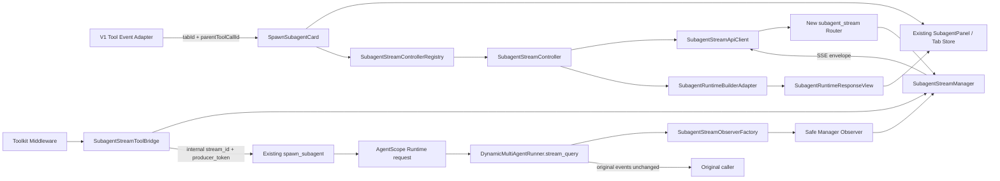
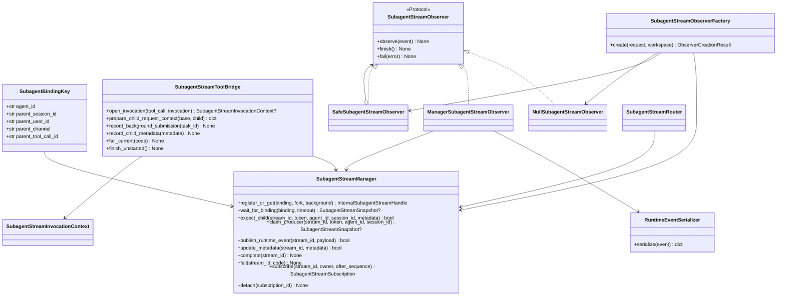
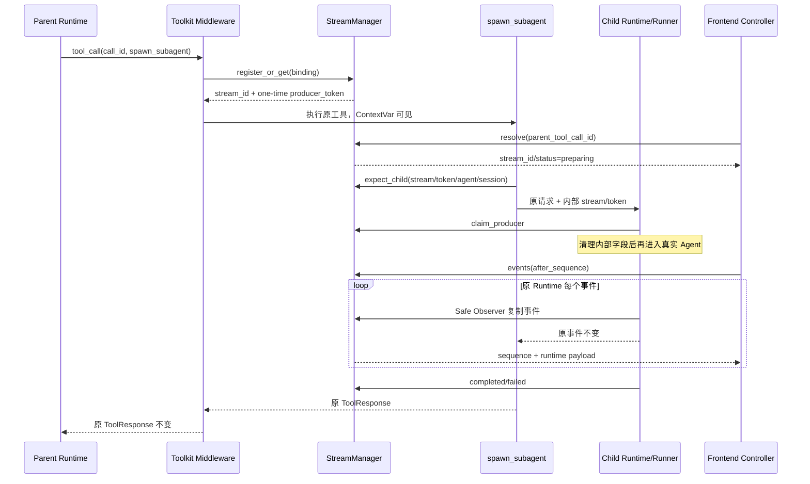
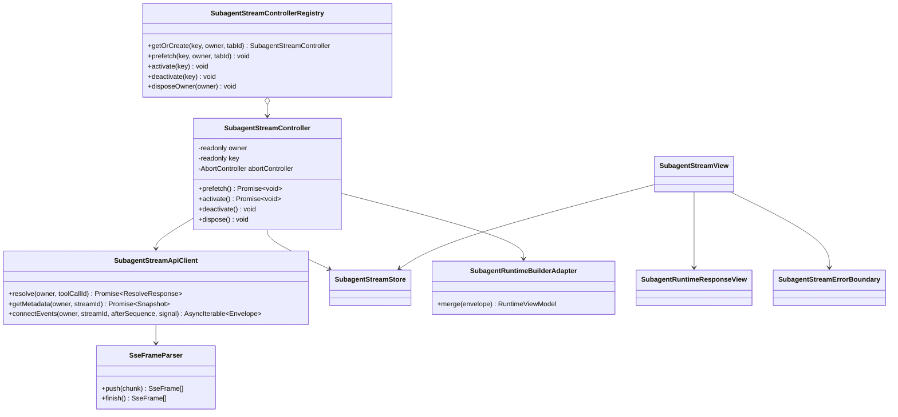

# spawn_subagent 流式输出：代码开发设计方案与测试验证方案

> 文档版本：v1.0  
> 编写日期：2026-07-23  
> 依据文档：[1需求与功能分析.md](./1需求与功能分析.md)、[2方案设计分析.md](./2方案设计分析.md)  
> 文档状态：已完成方案复审，可进入代码开发；尚未实施代码变更

## 1. 文档目的

本文将已审核的总体方案落实为可执行的代码开发设计和测试验证方案，回答以下问题：

1. 后端需要新增哪些类、接口和数据结构，它们如何关联；
2. 前端如何把父工具调用、独立 Tab 和子流连接正确绑定；
3. 哪些现有文件必须做最小接入修改，哪些现有路径明确保持不变；
4. 四种 `spawn_subagent` 模式如何统一接入同一套旁路流机制；
5. 如何验证父会话原有工具结果、普通会话流式返回和历史回退均不受影响；
6. 如何通过故障注入证明新增子流不会反向破坏原执行链路。

本方案只设计本期需求，不包含孙级 Subagent 独立侧边栏、跨进程流存储、页面内多窗口共享连接等扩展能力。

---

## 2. 对《2方案设计分析》的审核结论

### 2.1 总体结论

《2方案设计分析》的主方案可实施，满足“尽量新增、少改现有、避免影响现有功能、前后端低耦合”的约束。审核确认继续采用独立的 `SubagentStreamManager`，不复用、不继承 `TaskTracker`。

选择独立管理器的原因不是功能重复，而是两个对象的职责和生命周期不同：

| 对比项 | 现有 `TaskTracker` | 新增 `SubagentStreamManager` |
| --- | --- | --- |
| 核心职责 | 跟踪正在执行的任务 | 管理可绑定、可重放、可重连的 Subagent 事件流 |
| 主键 | 任务/外部任务标识 | 父 owner + 真实工具调用 ID + stream ID |
| 完成后数据 | 现有实现会移除活动项 | 需要保留一段时间供断线重连和晚打开 Tab 重放 |
| 消费方式 | 当前无独立订阅协议 | 多订阅者、sequence 游标、非阻塞队列 |
| 安全要求 | 无生产者认领协议 | secret producer token + child session 联合认领 |
| 容量策略 | 不满足本需求的重放边界 | 每流、每订阅者、总流数和 TTL 均需明确限制 |

复用 `TaskTracker` 会迫使修改其数据模型、完成语义和并发行为，反而扩大普通会话核心路径的回归面。

### 2.2 已核对并通过的关键设计项

| 审核项 | 审核结论 | 开发约束 |
| --- | --- | --- |
| 真实工具调用 ID | 必须读取 Runtime 的 `callData.call_id` | 新增可选 `toolCallId`；不得覆盖原 `content.id` |
| 三层 ID | `tabId`、`parentToolCallId`、`streamId` 必须分离 | 禁止用 `Date.now()` 或 UI ID 请求后端绑定 |
| 父工具结果 | 原 `spawn_subagent` ToolResponse 必须保持不变 | 不增加字段、不替换文本、不改变完成时机 |
| 四种模式 | 统一由 Toolkit middleware 注册，具体分支只注入内部上下文 | 不重写四种原执行分支 |
| Runner 采集点 | `DynamicMultiAgentRunner.stream_query` 是覆盖全部模式的合适旁路点 | 默认 Null Observer，观察异常不得进入原异常分支 |
| 生产者安全 | 公开的 stream/session/agent ID 不足以认领生产者 | 使用不回传前端的高熵 `producer_token` |
| 内部字段隔离 | token 和 stream 内部字段不能传给子 Agent/工具/插件 | 认领后复制并清理 `request_context` 再调用实际 Runner |
| SSE 重连 | 以 `sequence` 作为恢复游标 | 断线不取消子任务，慢消费者不反压生产者 |
| 前端 owner | 必须在 Controller 创建时固定 | 重连期间禁止重新读取当前全局会话 |
| SDK 渲染 | 侧边栏位于 Runtime UI Context 外 | 新增本地 View；SDK 深层静态 import 必须经过构建测试 |
| 嵌套 spawn | 不允许错误操作父级全局 Tab | 子流内嵌套 `spawn_subagent` 固定降级为 Generic ToolCard |
| 历史兼容 | 旧消息可能没有真实 `call_id` | 保留原轮询/历史展示，不发伪造绑定请求 |

### 2.3 本轮复审补充的三个强制约束

1. **内部凭据剥离是 Runner 接入的组成部分，不是可选安全优化。** 无论 producer token 是否有效，只要请求包含 QwenPaw 保留字段，Observer Factory 都必须在请求副本中删除这些字段；实际 Agent、工具和插件不能取得它们。
2. **SDK Builder 路径失效应在构建阶段失败。** 本期使用静态深层 import；依赖升级导致路径不存在时必须阻断 `tsc/vite build`，不能把静态模块缺失描述成运行时自动回退。只有运行期的事件合并或渲染异常可以由 Error Boundary 回退到历史视图。
3. **嵌套 `spawn_subagent` 必须无全局副作用。** 子流消息内的嵌套工具仅展示 Generic ToolCard，不预取绑定、不创建第二层侧边栏、不修改父页面的 Tab Store。

### 2.4 审核后的实施门槛

只有同时满足以下条件才允许合入：

- 所有新增逻辑关闭或不可用时，原普通会话和原 `spawn_subagent` 行为完全一致；
- 四种模式均通过真实事件流测试，而不是只验证绑定接口；
- 后端 Observer 任意步骤失败时，原 `stream_query` 仍按原顺序返回原事件；
- 前端没有真实 `parentToolCallId` 时不访问 resolve/events 接口；
- `npm run build` 能验证 SDK 静态适配层；
- 原相关单元测试和新增回归测试全部通过。

---

## 3. 开发目标、非目标与最小改动策略

### 3.1 开发目标

1. 父会话出现 `spawn_subagent` 工具调用后，前端可用真实工具调用 ID 尽早解析到 `streamId`；
2. 用户点击工具名称时，为每个子任务打开一个独立 Tab；
3. Tab 可实时显示子 Agent 的全部 Runtime 执行过程消息；
4. 页面或 Tab 切换会断开当前 SSE，重新激活时从最后 `sequence` 续传；
5. 同一父会话的多个子任务使用独立复合键、独立 Controller、独立游标；
6. 子任务完成后仍保留有限时间的事件，支持晚打开和断线重放；
7. 父会话已有工具卡结果和 SubagentPanel 历史/轮询行为保持兼容。

### 3.2 明确不做

- 不修改 AgentScope Runtime 第三方包源码；
- 不复用或扩展 `TaskTracker`；
- 不修改普通会话现有 SSE 协议；
- 不让前端直接携带生产者 token；
- 不持久化完整 Runtime 事件到数据库；
- 不为孙级 Subagent 自动创建嵌套侧边栏；
- 不在本期增加跨进程 Redis/Kafka 事件总线；
- 不改变 `spawn_subagent` 四种模式的返回内容、任务调度方式或 fork 语义。

### 3.3 最小改动规则

开发时按以下优先级执行：

1. 新能力优先放入新的 `subagent_stream` 后端包和新的前端目录；
2. 现有文件只保留“注册、委托、选择视图”三类薄接入点；
3. 不重构与需求无关的普通聊天、工具卡、Tab Store 和 TaskTracker；
4. 新字段全部可选，新接口全部旁路；
5. 任一新增组件失败，回退原工具结果、原轮询或原历史展示；
6. 不以改造公共底层框架为代价减少少量重复代码。

---

## 4. 总体代码结构



新增链路是原执行链路的旁路观察者。`DynamicMultiAgentRunner` 仍向原调用方返回同一批事件；新增 Manager 只复制可序列化事件并提供独立订阅。

---

## 5. 设计模式选择

本方案使用模式是为了隔离变化点，不为模式本身增加无必要的类层次。

| 设计模式 | 使用位置 | 解决的问题 |
| --- | --- | --- |
| 策略模式 | `SubagentStreamObserver` | Runner 不关心当前是空观察、Manager 采集还是后续其他采集策略 |
| Null Object | `NullSubagentStreamObserver` | 普通会话和认领失败请求无需到处写分支，默认无副作用 |
| 工厂模式 | `SubagentStreamObserverFactory` | 集中完成内部字段提取、生产者认领、请求清理和 Observer 创建 |
| 装饰器模式 | `SafeSubagentStreamObserver` | 捕获 delegate 的序列化、发布、完成异常，保护原生成器 |
| 外观/桥接模式 | `SubagentStreamToolBridge` | 将 `spawn_subagent` 对 Manager/ContextVar 的接入压缩成少量方法调用 |
| 观察者/发布订阅 | `SubagentStreamManager` 与 Subscription | 一个生产者向一个或多个 SSE 订阅者复制事件，订阅者互不反压 |
| 适配器模式 | `RuntimeEventSerializer`、`SubagentRuntimeBuilderAdapter`、V1 adapter | 隔离第三方 Runtime 事件结构和 SDK Builder 深层路径 |
| 注册表/Multiton | `SubagentStreamControllerRegistry` | 每个复合键唯一 Controller，不同父会话/工具调用互不碰撞 |
| 有限状态机 | Manager 中的状态迁移表 | 统一约束 preparing/running/terminal 状态，不额外拆成多组 State 类 |

不使用以下做法：

- 不用继承 `TaskTracker` 模拟 Manager；
- 不用全局单例前端 Controller 服务全部会话；
- 不为四种 spawn 模式分别创建四套策略类，因为它们的差异已由原代码负责，新流逻辑相同；
- 不用代理替换 `spawn_subagent` 返回对象，避免改变现有工具结果。

---

## 6. 后端类、接口与关联设计

### 6.1 新增包建议

```text
src/qwenpaw/app/subagent_stream/
├── __init__.py
├── models.py
├── manager.py
├── context.py
├── tool_bridge.py
├── serialization.py
├── observer.py
└── router.py
```

模块只依赖 QwenPaw 应用层和 Python 标准库，不反向依赖 console，不修改 AgentScope 安装包。

### 6.2 后端类图



### 6.3 `models.py`：数据模型

#### 6.3.1 绑定键和状态

```python
@dataclass(frozen=True, slots=True)
class SubagentBindingKey:
    agent_id: str
    parent_session_id: str
    parent_user_id: str
    parent_channel: str
    parent_tool_call_id: str


class SubagentStreamStatus(str, Enum):
    PREPARING = "preparing"
    RUNNING = "running"
    COMPLETED = "completed"
    FAILED = "failed"
    CANCELLED = "cancelled"
    EXPIRED = "expired"
```

允许的状态迁移：

```text
preparing -> running -> completed
preparing -> failed | cancelled | expired
running   -> failed | cancelled | expired
terminal  -> terminal（幂等，不允许回到 running）
```

#### 6.3.2 事件和快照

建议新增：

- `SubagentStreamEventKind`：`metadata`、`runtime`、`status`、`error`；
- `SubagentStreamEvent`：`stream_id`、`sequence`、`kind`、`payload`、`created_at`；
- `SubagentStreamSnapshot`：只含可回传前端的 owner、模式、子 session/chat/task 元数据、状态和 sequence 边界；
- `SubagentStreamRun`：Manager 内部可变对象，含事件缓冲、token digest、订阅者和过期时间；
- `SubagentStreamSubscription`：订阅 ID、只读重放列表、有限队列和断开原因；
- `SubagentStreamLimits`：集中定义 TTL、每流最大事件数、单事件最大字节、订阅队列大小和总流数。

内部与公开 Handle 必须区分：

```python
@dataclass(frozen=True, slots=True)
class InternalSubagentStreamHandle:
    snapshot: SubagentStreamSnapshot
    producer_token: str | None
    created: bool
```

首次 `register_or_get` 创建 Run 时返回一次原始 token；同一绑定的重复注册只返回已有公开快照且 `producer_token=None`，避免第二个工具执行者重复取得生产资格。Router 永远只返回 `SubagentStreamSnapshot`，类型上不存在 token 字段。

### 6.4 `manager.py`：独立流管理器

#### 6.4.1 公共接口

```python
class SubagentStreamManager:
    async def register_or_get(
        self,
        binding: SubagentBindingKey,
        *,
        fork: bool,
        background: bool,
    ) -> InternalSubagentStreamHandle: ...

    async def wait_for_binding(
        self,
        binding: SubagentBindingKey,
        *,
        timeout_seconds: float,
    ) -> SubagentStreamSnapshot | None: ...

    async def expect_child(
        self,
        stream_id: str,
        producer_token: str,
        *,
        agent_id: str,
        child_session_id: str,
        metadata: Mapping[str, Any] | None = None,
    ) -> bool: ...

    async def claim_producer(
        self,
        stream_id: str,
        producer_token: str,
        *,
        agent_id: str,
        child_session_id: str,
    ) -> SubagentStreamSnapshot | None: ...

    async def publish_runtime_event(
        self, stream_id: str, payload: Mapping[str, Any]
    ) -> bool: ...

    async def update_metadata(
        self, stream_id: str, metadata: Mapping[str, Any]
    ) -> bool: ...

    async def complete(self, stream_id: str) -> None: ...
    async def fail(self, stream_id: str, code: str) -> None: ...
    async def cancel(self, stream_id: str) -> None: ...

    async def subscribe(
        self,
        stream_id: str,
        owner: SubagentStreamOwner,
        *,
        after_sequence: int,
    ) -> SubagentStreamSubscription: ...

    async def detach(self, subscription_id: str) -> None: ...
```

通过 `get_subagent_stream_manager()` 提供进程内实例。首版采用惰性清理：每次 register/resolve/subscribe/publish 时清理过期 Run，从而不修改现有应用 lifespan。后续如需独立清理任务，应作为单独变更评审。

#### 6.4.2 并发和非反压规则

- Run、绑定索引和订阅者修改在短临界区内完成；
- 不在 Manager 锁内执行网络 I/O、日志格式化或第三方序列化；
- 事件进入每个订阅者队列使用 `put_nowait`；
- 单个订阅者队列满时只关闭该订阅者并记录 `slow_consumer`，不得阻塞生产者或其他订阅者；
- 每个 Run 的 `sequence` 从 1 单调递增，metadata/status/runtime 共用一条序列；
- terminal 操作幂等，重复 finish/fail 不产生反向状态迁移；
- 重放范围不足时，SSE 首帧声明 `reset_required=true`，前端回退 metadata/history，不伪装成完整重放。

#### 6.4.3 producer token

- 创建时使用 `secrets.token_urlsafe(32)`；
- Manager 只保存 SHA-256 digest；
- 校验使用 `hmac.compare_digest`；
- 原始 token 只存在于首次内部 Handle、ContextVar 和子请求内部上下文；
- token 不进入 API schema、SSE、日志、异常字符串、Chat 历史；
- 生产者认领必须同时匹配 `stream_id + token + agent_id + expected_child_session_id`；
- token 验证失败不会中止普通 AgentRequest，只会禁止写入子流。

### 6.5 `context.py`：一次工具调用的内部上下文

```python
@dataclass(frozen=True, slots=True)
class SubagentStreamInvocationContext:
    stream_id: str
    producer_token: str
    binding: SubagentBindingKey
```

使用一个专用 `ContextVar[SubagentStreamInvocationContext | None]`，并提供：

- `get_current_subagent_stream_invocation()`；
- `set_current_subagent_stream_invocation(context)`；
- `reset_current_subagent_stream_invocation(token)`；
- `install_subagent_stream_toolkit_middleware(toolkit, invocation_provider)`。

Middleware 必须在 `try/finally` 中恢复 ContextVar，避免父会话同进程并发工具调用串流。它只对工具名严格等于 `spawn_subagent` 且能取得真实 `call_id` 的调用注册；缺少真实 ID 时直接执行原工具函数。

### 6.6 `tool_bridge.py`：对现有 `spawn_subagent` 的薄外观

`SubagentStreamToolBridge` 隐藏 ContextVar、Manager、内部字段名和容错细节，现有工具代码只调用少量稳定方法：

```python
class SubagentStreamToolBridge:
    async def prepare_child_request_context(
        self,
        base_context: Mapping[str, Any] | None,
        *,
        agent_id: str,
        child_session_id: str,
        metadata: Mapping[str, Any] | None = None,
    ) -> dict[str, Any]: ...

    async def record_background_submission(self, task_id: str) -> None: ...
    async def record_child_metadata(self, **metadata: Any) -> None: ...
    async def fail_current(self, code: str) -> None: ...
```

`prepare_child_request_context` 返回新字典，不修改传入对象。仅在当前 ContextVar 存在且 `expect_child` 成功时增加：

```python
{
    "_qwenpaw_subagent_stream_id": stream_id,
    "_qwenpaw_subagent_producer_token": producer_token,
}
```

所有 Bridge 异常必须在 Bridge 内捕获并记录低敏错误码，然后返回原上下文副本；不得改变原 `spawn_subagent` 返回或抛错语义。

### 6.7 `serialization.py`：Runtime 事件适配器

```python
class RuntimeEventSerializer:
    def serialize(self, event: Any) -> dict[str, Any]: ...
```

适配顺序固定为：

1. Pydantic v2 `model_dump(mode="json")`；
2. 兼容对象的 `dict()`；
3. 已是 Mapping 时浅复制；
4. 其他类型判定为不支持并抛出内部 `SubagentStreamSerializationError`。

序列化器不修改原 event，不把任意对象的 `repr` 回传前端。单事件超过大小限制时关闭对应子流并发送有限错误状态；原 Runner 事件仍继续 yield 给原调用方。

### 6.8 `observer.py`：策略、工厂与安全装饰器

#### 6.8.1 接口

```python
class SubagentStreamObserver(Protocol):
    async def observe(self, event: Any) -> None: ...
    async def finish(self) -> None: ...
    async def fail(self, error: BaseException) -> None: ...
```

- `NullSubagentStreamObserver`：三个方法均为 no-op；
- `ManagerSubagentStreamObserver`：序列化、发布和更新状态；
- `SafeSubagentStreamObserver`：装饰任意 delegate，捕获所有观察异常，必要时仅关闭子流并把 delegate 降级为 Null；
- `SubagentStreamObserverFactory`：从请求创建观察者，并返回清理后的请求。

#### 6.8.2 Factory 返回对象

```python
@dataclass(frozen=True, slots=True)
class ObserverCreationResult:
    request_for_runner: AgentRequest
    observer: SubagentStreamObserver
```

`create` 的处理顺序：

1. 无条件复制 `request_context`；
2. 读取两个 QwenPaw 保留字段；
3. 从副本删除两个保留字段，即使字段为空或伪造也删除；
4. 使用 `model_copy(update={"request_context": cleaned})` 或等价浅复制构造 `request_for_runner`；
5. 缺少字段时返回 Null Observer；
6. 字段齐全时用 agent/session/token 原子认领；
7. 认领成功返回 `SafeSubagentStreamObserver(ManagerObserver)`，失败返回 Null Observer；
8. Factory 自身任何异常也必须返回“已尽可能清理的请求 + Null Observer”，不得向外抛出。

这样实际 `workspace.runner.stream_query(request_for_runner)` 看不到内部 token 和 stream ID，同时保留 `fork_project_dir`、root 和其他原 request context 字段。

### 6.9 `router.py`：前端绑定与 SSE 接口

新增独立 Router，由现有 `/api` 聚合路由 include：

| 方法 | 路径 | 作用 |
| --- | --- | --- |
| `POST` | `/api/subagent-streams/resolve` | 用父 owner + 真实工具调用 ID 查找 Stream Run，可短时等待注册 |
| `POST` | `/api/subagent-streams/{stream_id}/metadata` | 获取公开快照，支持晚到的 child session/chat/task 元数据 |
| `POST` | `/api/subagent-streams/{stream_id}/events` | 以 fetch SSE 建立流，body 含 `after_sequence` |

Router 从现有鉴权上下文取得 user/channel，并通过现有 agent 访问校验，不信任前端提交的 user ID。前端 body 只提交：

```json
{
  "agent_id": "agent-id",
  "parent_session_id": "runtime-parent-session-id",
  "parent_tool_call_id": "callData.call_id"
}
```

`resolve` 的公开响应示例：

```json
{
  "found": true,
  "retry_after_ms": null,
  "stream": {
    "stream_id": "uuid",
    "status": "preparing",
    "fork": false,
    "background": true,
    "child_session_id": null,
    "child_chat_id": null,
    "task_id": null,
    "latest_sequence": 1
  }
}
```

未注册时返回正常 pending 响应和建议重试间隔，不创建 Run，不接受伪造 UI ID。events 端点输出：

```text
id: <stream_id>:<sequence>
event: subagent
data: {"stream_id":"...","sequence":2,"kind":"runtime","payload":{...}}

```

并定期输出 SSE comment heartbeat。客户端断开只执行 `detach`，不调用 cancel，不影响后台或前台子任务。

### 6.10 后端现有文件的最小修改点

| 现有文件 | 必须修改的内容 | 明确不改 |
| --- | --- | --- |
| `src/qwenpaw/agents/react_agent.py` | Toolkit 创建后注册一次新增 middleware | 不改现有工具表、不改工具执行顺序 |
| `src/qwenpaw/agents/tools/agent_management.py` | 四种模式构造子请求时调用 Bridge 生成 context；记录 child/task 元数据 | 不改函数签名、分支条件、请求路径和 ToolResponse |
| `src/qwenpaw/app/_app.py` | `DynamicMultiAgentRunner.stream_query` 开头创建 Observer/清理请求；每次原 yield 前旁路 observe；原结束/异常处通知 Observer | 不删改现有 TaskTracker 注册/注销，不改原错误事件格式 |
| `src/qwenpaw/app/routers/__init__.py` | include 新 Router | 不修改现有 Router 路径 |

建议的 Runner 接入伪代码：

```python
creation = await observer_factory.create(request, workspace)
observer = creation.observer  # 工厂保证最差为 Null

try:
    # 保留原 TaskTracker register 逻辑
    async for item in workspace.runner.stream_query(creation.request_for_runner):
        await observer.observe(item)  # Safe Observer 不向外抛出
        yield item                    # 原对象、原顺序、原次数
    await observer.finish()
except Exception as exc:
    await observer.fail(exc)          # Safe Observer 不向外抛出
    # 完整保留现有异常处理与原错误事件
finally:
    # 完整保留现有 TaskTracker unregister 逻辑
```

开发时应以局部 helper 调用替换伪代码，避免重排原 try/except/finally。特别是观察事件必须发生在原 yield 附近，但 Observer 故障绝不能进入原 `stream_query` 的异常分支。

---

## 7. 四种 `spawn_subagent` 模式的接入设计

四种模式不新增策略分支，只在原来已经确定 child session 和请求 payload 的位置注入同一组内部字段。

| fork | background | 原调用 | 新增流注册/认领 | 原结果要求 |
| --- | --- | --- | --- | --- |
| false | false | `/agent/process`，等待完成 | middleware 注册；发送前 expect child；Dynamic Runner 立即认领并采集 | 原前台工具结果不变 |
| true | false | fork 后 `/agent/process`，等待完成 | fork 成功取得 child session 后 expect；Runner 认领采集 | fork 目录、会话和结果不变 |
| false | true | `/agent/process/task`，立即返回任务信息 | middleware 注册；提交前 expect；记录 task ID；后台 Runner 随后认领 | 原后台工具结果不变 |
| true | true | fork 后 `/agent/process/task` | fork 成功后 expect；记录 task ID；后台 Runner 认领 | 原 fork/background 结果不变 |

统一时序：



异常原则：

- middleware/Manager/Bridge 失败：不创建或停止子流观察，继续原工具调用；
- fork 或请求提交原本失败：保留原异常语义，同时尽力将新增 Stream Run 标记失败；
- background 前端断线：后台任务继续；
- 前台父请求取消：沿用原取消语义，Manager 只记录最终状态；
- 子流序列化失败：只关闭子流，不影响原工具结果。

---

## 8. 前端类、接口与关联设计

### 8.1 新增目录建议

```text
console/src/pages/Chat/components/SubagentPanel/stream/
├── types.ts
├── streamKey.ts
├── sseFrameParser.ts
├── subagentStreamApi.ts
├── subagentStreamStore.ts
├── SubagentStreamController.ts
├── SubagentStreamControllerRegistry.ts
├── SubagentRuntimeBuilderAdapter.ts
├── SubagentStreamView.tsx
├── SubagentRuntimeResponseView.tsx
├── SubagentToolMessageView.tsx
└── SubagentStreamErrorBoundary.tsx
```

如现有目录命名规则要求，可调整文件位置，但 Adapter、Controller、Store、View 的职责不得合并进现有大组件。

### 8.2 三层 ID 与 owner

在现有 `ToolCallContent` 上只新增可选字段：

```ts
interface ToolCallContent {
  id: string;              // 现有 UI tab/card ID，保持原生成规则
  toolCallId?: string;     // 新增：仅来自 callData.call_id
  // 其他现有字段保持不变
}
```

标识规则：

| 名称 | 来源 | 用途 |
| --- | --- | --- |
| `tabId` | 现有 `content.id` | 打开/定位现有 Subagent Tab |
| `parentToolCallId` | 新增 `content.toolCallId`，只取 `callData.call_id` | 请求后端 resolve |
| `streamId` | 后端公开快照 | 建立 SSE、metadata 查询 |

V1 adapter 仍按原逻辑计算 `content.id`，只并列增加：

```ts
toolCallId: typeof callData.call_id === 'string'
  ? callData.call_id
  : undefined
```

不得把 `callData.id`、`data.id` 或 `Date.now()` 生成值写入 `toolCallId`。

Controller owner：

```ts
interface SubagentStreamOwner {
  agentId: string;
  parentSessionId: string; // 已转换为后端 Runtime session ID
}

interface SubagentStreamKey {
  agentId: string;
  parentSessionId: string;
  parentToolCallId: string;
}
```

`createSubagentStreamKey` 使用三个字段生成稳定序列化键。`tabId` 不进入后端绑定键，`streamId` 不替换 Tab key。

### 8.3 前端类图



### 8.4 `SubagentStreamApiClient`

职责：

- 统一调用 `getApiUrl` 和 `buildAuthHeaders`；
- resolve/metadata 使用现有 request 约定；
- events 使用 `fetch` POST 并读取 `ReadableStream`；
- 将字节流交给纯 `SseFrameParser`；
- 只负责协议和网络，不写 Zustand Store，不读取全局当前会话。

`SseFrameParser` 必须覆盖：任意 chunk 边界、CRLF/LF、连续 `data:` 行、`id:`、`event:`、heartbeat comment、末帧无空行和 UTF-8 跨 chunk。

### 8.5 `SubagentStreamStore`

Store 使用复合键保存：

```ts
interface SubagentStreamRecord {
  key: string;
  tabId: string;
  owner: Readonly<SubagentStreamOwner>;
  parentToolCallId: string;
  streamId?: string;
  status: 'idle' | 'resolving' | 'connecting' | 'streaming'
    | 'completed' | 'failed' | 'fallback';
  lastSequence: number;
  snapshot?: SubagentStreamSnapshot;
  viewModel?: SubagentRuntimeViewModel;
  errorCode?: string;
}
```

Store action 只接受显式 key，不调用 `sessionApi.getSessionIdentity()`。不同会话即使出现相同工具 call ID，也因 owner 不同而落入不同记录。

### 8.6 `SubagentStreamController`

Controller 构造时复制并冻结 owner，之后所有 resolve、metadata 和重连都使用该副本。状态流程：

```text
idle -> resolving -> connecting -> streaming -> completed
                 \-> fallback
streaming -> reconnecting -> streaming
任意非终态 -> failed/fallback
```

主要行为：

1. `prefetch()`：工具卡获得真实 `parentToolCallId` 后即可 resolve，不等待用户打开 Tab；
2. `activate()`：若已有 `streamId`，立即从 `lastSequence` 连接；否则先 resolve；
3. `deactivate()`：abort 当前 fetch，只断连接，不删除 Store，不取消后端任务；
4. `dispose()`：页面 owner 离开时清理计时器和连接；
5. 自动重连退避：500ms、1s、2s、5s，之后保持 5s，并加入小幅 jitter；
6. 收到重复 sequence 时忽略；收到跳号或 `reset_required` 时查询 metadata，并切换历史回退而不是错误拼接；
7. 收到 terminal status 后停止重连；
8. resolve 多次 pending 时按 `retry_after_ms` 重试，缺少真实 call ID 时完全不启动。

`SubagentStreamControllerRegistry` 是按复合键持有实例的 Multiton。它避免 React 重渲染重复创建连接，也保证父会话多个子任务分别持有 AbortController 和游标。

### 8.7 Runtime 事件合并和本地渲染

`SubagentRuntimeBuilderAdapter.ts` 是唯一允许深层静态 import SDK Builder 的文件：

```ts
import { AgentScopeRuntimeResponseBuilder } from
  '@agentscope-ai/chat/lib/AgentScopeRuntimeWebUI/core/AgentScopeRuntime/Response/Builder';
```

具体导出形式以当前锁定版本源码为准。规则：

- Adapter 每个 Controller/stream 独立维护 Builder 或合并状态；
- 第三方事件转本地 `SubagentRuntimeViewModel`，React View 不直接持有第三方 Context；
- import 路径失效由 TypeScript/Vite 构建失败暴露并阻止发布；
- 运行期单条事件合并失败由 Error Boundary/Controller 转为 fallback，不影响父页面；
- `SubagentRuntimeResponseView` 本地渲染 message、reasoning、tool、error 和已支持媒体；
- 工具卡使用本地适配后的 registry；嵌套 `spawn_subagent` 强制选择 Generic ToolCard；
- 不直接复用依赖 `AgentScopeRuntimeWebUI` Options Context 的完整 ResponseCard。

### 8.8 现有前端文件的最小修改点

| 现有文件 | 修改内容 | 不改内容 |
| --- | --- | --- |
| `ToolCards/shared/types.ts` | 增加可选 `toolCallId?: string` | 不改变现有必填字段 |
| `ToolCards/adapters/v1Adapter.tsx` | 映射 `callData.call_id`；必要时导出纯解析 helper 便于测试 | 不替换原 `content.id` |
| `SpawnSubagentCard.tsx` | 固定 owner；真实 ID 存在时调用 Registry prefetch；点击仍打开原 Tab | 不改变工具结果文案和原 metadata 提取 |
| `SubagentPanel` 入口组件 | 对有可用 stream 记录的 Tab 渲染 `SubagentStreamView`，否则走原轮询/历史 View | 不重写原历史转换与 Tab Store |
| i18n/样式文件 | 只增加连接中、重连、回退等文案和局部样式 | 不全局改主题 |

历史工具卡或解析不到 `callData.call_id` 时：

```text
SpawnSubagentCard -> 原 openTab -> 原 SubagentPanel 轮询/历史
```

该路径不调用任何新增后端接口，是旧数据的兼容基线。

### 8.9 页面切换、断连与重连

- 同一页面切换 Subagent Tab：旧 Tab `deactivate`，新 Tab `activate`；
- 关闭侧边栏：所有当前显示连接 abort，但 Store 中 lastSequence 保留；
- 返回同一父会话：使用固定 owner + tool call ID 找回记录并续传；
- 切换到另一父会话：旧 owner Controller 全部断开；新 owner 使用新复合键，不共享游标；
- Chat 页面卸载：Registry `disposeOwner`；后端 Run 继续到 terminal/TTL；
- 浏览器网络异常：Controller 自动退避重连，提交 `after_sequence=lastSequence`；
- 后端已清除缓存：切到原 metadata/history 回退，不影响父工具卡。

---

## 9. 接口协议与错误边界

### 9.1 SSE Envelope

```ts
interface SubagentStreamEnvelope {
  stream_id: string;
  sequence: number;
  kind: 'metadata' | 'runtime' | 'status' | 'error';
  payload: Record<string, unknown>;
  created_at: string;
}
```

前端只按 `kind` 分发，不依赖后端 Python 类名。Runtime payload 保持当前 AgentScope 序列化结构，由单一 Adapter 负责版本适配。

### 9.2 对外错误码

对外只暴露稳定错误码，不回传堆栈和 token：

| 错误码 | 含义 | 前端行为 |
| --- | --- | --- |
| `stream_not_found` | Run 未创建或已过期 | resolve 重试有限次数，随后历史回退 |
| `stream_forbidden` | owner 不匹配 | 停止连接，显示无权限通用提示 |
| `stream_gap` | 请求游标早于最早保留事件 | metadata/history 回退 |
| `slow_consumer` | 当前订阅队列满 | 以 lastSequence 重连；重复出现则回退 |
| `stream_serialization_failed` | 子流序列化失败 | 子流失败，原工具调用继续 |
| `stream_expired` | terminal Run 已清理 | 历史回退 |

### 9.3 故障隔离边界

```text
原父会话 / 原子 Agent 执行
        |
        +-- 新流成功：复制事件 -> SSE
        |
        +-- 新流失败：Null Observer / 关闭单个子流
                       原事件、原结果、原异常继续
```

禁止新增代码执行以下动作：

- 因 Manager 不可用而取消原子任务；
- 因前端断线而取消 background task；
- 把 Observer 错误包装成原 `stream_query` 错误事件；
- 修改或消费掉原异步生成器事件；
- 让慢 SSE 客户端 await 原 Runtime 生产者；
- 在日志中输出原始 request context。

---

## 10. 文件级开发清单

### 10.1 后端新增文件

| 文件 | 主要内容 |
| --- | --- |
| `src/qwenpaw/app/subagent_stream/models.py` | 绑定、状态、事件、快照、内部 Run、限制和 API schema |
| `src/qwenpaw/app/subagent_stream/manager.py` | 注册、认领、发布、重放、订阅、TTL 清理 |
| `src/qwenpaw/app/subagent_stream/context.py` | ContextVar 和 Toolkit middleware 安装 |
| `src/qwenpaw/app/subagent_stream/tool_bridge.py` | 对 spawn 工具的无侵入接入外观 |
| `src/qwenpaw/app/subagent_stream/serialization.py` | Runtime 事件安全序列化 Adapter |
| `src/qwenpaw/app/subagent_stream/observer.py` | Protocol、Null、Manager、Safe Observer、Factory、请求清理 |
| `src/qwenpaw/app/subagent_stream/router.py` | resolve、metadata、events SSE |
| `src/qwenpaw/app/subagent_stream/__init__.py` | 仅导出稳定公共入口 |

### 10.2 前端新增文件

见 8.1 目录；其中 API、Parser、Store、Controller、Registry、Builder Adapter 和 View 均为新增。

### 10.3 新增测试文件建议

```text
tests/unit/app/subagent_stream/
├── test_manager.py
├── test_context.py
├── test_tool_bridge.py
├── test_serialization.py
├── test_observer.py
└── test_router.py

tests/integration/app/
└── test_subagent_stream_flow.py

console/src/components/Chat/ToolCards/adapters/__tests__/
└── v1Adapter.spawnSubagent.test.tsx

console/src/pages/Chat/components/SubagentPanel/stream/__tests__/
├── sseFrameParser.test.ts
├── subagentStreamStore.test.ts
├── SubagentStreamController.test.ts
├── SubagentStreamControllerRegistry.test.ts
├── SubagentRuntimeBuilderAdapter.test.ts
└── SubagentStreamView.test.tsx
```

测试文件位置最终遵循仓库现有约定，但不要把大量新测试混入一个现有大测试文件。

---

## 11. 分阶段代码开发顺序

### 阶段 A：纯后端基础设施

1. 新增 models、manager 及其单元测试；
2. 新增 serializer、observer 和生产者认领/请求清理测试；
3. 新增 context/middleware、tool bridge 测试；
4. 新增 Router 和 SSE 重放测试。

此阶段不接入现有 `spawn_subagent`，可独立验证并发、安全和协议。

### 阶段 B：后端最小接入

1. 在 Toolkit 创建处注册 middleware；
2. 在 `spawn_subagent` 四种分支的请求构造点调用 Bridge；
3. 在 Dynamic Runner 增加 Factory + Safe Observer 旁路；
4. include 新 Router；
5. 运行普通会话、TaskTracker 和 agent_management 原回归测试。

### 阶段 C：前端协议层

1. V1 adapter 添加可选真实 ID；
2. 新增 stream key、API、SSE Parser、Store；
3. 新增 Controller 和 Registry；
4. 完成 owner 固定、重连和多任务隔离测试。

### 阶段 D：前端视图接入

1. 新增 Builder Adapter 和本地 Runtime View；
2. 工具卡真实 ID 存在时 prefetch；
3. SubagentPanel 仅增加流视图选择，保留原 fallback；
4. 增加嵌套 spawn Generic 卡测试；
5. 运行完整前端构建验证深层静态 import。

### 阶段 E：端到端和故障注入

完成四模式、并发、多会话、断线、晚打开、Manager/序列化异常和普通会话回归。

每个阶段应独立可回退，不在同一次改动中顺便重构普通 Chat 页面。

---

## 12. 测试验证方案

### 12.1 测试分层

| 层级 | 目标 | 是否需要真实 Runtime |
| --- | --- | --- |
| 后端纯单元测试 | Manager、token、状态机、Observer、Bridge、Router schema | 否 |
| 前端纯单元测试 | ID、复合键、Parser、Store、Controller 状态机 | 否 |
| 组件测试 | 工具卡、Panel、Runtime 本地渲染、fallback | 否，可 mock Builder/API |
| 后端集成测试 | middleware -> spawn -> Dynamic Runner -> Manager -> SSE | 可使用可控 fake runner，关键用例再接真实 Runtime |
| 端到端测试 | 四模式和 UI 侧边栏实时输出 | 是 |
| 回归测试 | 普通 Chat SSE、原工具结果、TaskTracker、历史 Tab | 按现有测试环境 |

### 12.2 后端 Manager 单元测试

| 编号 | 场景 | 断言 |
| --- | --- | --- |
| BM-01 | 首次 register | 生成唯一 stream ID 和一次性 token；公开快照无 token |
| BM-02 | 同一绑定重复 register | 返回同一 stream；第二次 token 为 None |
| BM-03 | 不同工具 call ID | 即使父 session 相同也生成独立 Run |
| BM-04 | 不同父 session 同 call ID | Run 不碰撞 |
| BM-05 | expect + 正确认领 | 状态 preparing -> running |
| BM-06 | token 错误/缺失 | 认领失败，不产生 runtime 事件 |
| BM-07 | child session/agent 错误 | 认领失败 |
| BM-08 | sequence | 各 kind 共用单调连续序列 |
| BM-09 | after_sequence 重放 | 只返回游标之后的事件，随后进入实时队列 |
| BM-10 | 慢订阅者队列满 | 只关闭该订阅者，publish 不阻塞，其他订阅正常 |
| BM-11 | terminal 幂等 | completed 后 fail/finish 不反向修改 |
| BM-12 | TTL 清理 | 到期后 resolve 失败且资源释放 |
| BM-13 | 总流数/事件大小限制 | 有稳定错误码，无未界定内存增长 |
| BM-14 | 并发 publish/subscribe | 无重复 sequence、无死锁 |

### 12.3 后端 Observer、Context 和 Bridge 单元测试

| 编号 | 场景 | 断言 |
| --- | --- | --- |
| BO-01 | 普通请求无内部字段 | Factory 返回 Null，原 request 行为不变 |
| BO-02 | 合法内部字段 | 成功认领，实际 runner request 已删除两个保留字段 |
| BO-03 | 伪造/无效 token | 返回 Null；保留字段仍从副本删除；请求继续 |
| BO-04 | 原 request context 有 fork/root 等字段 | 清理后其他字段完整保留，原对象未被修改 |
| BO-05 | serializer 抛错 | Safe Observer 只关闭子流，不向 Runner 抛出 |
| BO-06 | Manager publish/finish/fail 抛错 | 原 async generator 事件次数和顺序完全一致 |
| BO-07 | ContextVar 并发工具调用 | 每个 call 取得独立 stream/token，不串流 |
| BO-08 | 非 spawn 工具 | middleware 不注册，不改变调用参数/返回 |
| BO-09 | spawn 缺少真实 call_id | 不注册，原工具正常执行 |
| BO-10 | Bridge 内部异常 | 返回原 context 副本，原 ToolResponse/异常不变 |
| BO-11 | token 泄漏扫描 | API、SSE、日志捕获和 child Agent context 均无 token |
| BO-12 | Runtime Mapping/Pydantic 事件 | 序列化结果可 JSON 编码且不修改原对象 |

### 12.4 后端 Router/SSE 测试

| 编号 | 场景 | 断言 |
| --- | --- | --- |
| BR-01 | resolve 先于 middleware 注册 | 短时等待后可返回 found，或返回可重试 pending |
| BR-02 | owner 正确/错误 | 正确可访问，错误 owner 返回 forbidden 且不泄露存在性细节 |
| BR-03 | stream 仍 preparing | 可立即建立 SSE，先收到 metadata/status |
| BR-04 | 中途断连重连 | 用 last sequence 精确续传，无重复或遗漏的保留事件 |
| BR-05 | 完成后连接 | 重放 retained events 和 terminal 状态后正常结束 |
| BR-06 | 游标过旧 | 返回 `stream_gap/reset_required`，不拼接错误历史 |
| BR-07 | heartbeat | comment 不消耗 sequence，前端 parser 忽略 |
| BR-08 | 客户端断连 | Subscription 删除；子任务状态和生产者不变 |
| BR-09 | Router 请求不能注册生产者 | 无公开接口返回/接收 producer token |

### 12.5 四模式后端集成测试

对每种组合运行相同断言：

| 编号 | fork | background | 重点验证 |
| --- | --- | --- | --- |
| BI-01 | false | false | 创建即绑定、前台实时事件、完成状态、原 ToolResponse |
| BI-02 | true | false | fork child session 认领正确、原 fork context 保留 |
| BI-03 | false | true | 工具先返回 task ID，后续后台事件继续进入同一 stream |
| BI-04 | true | true | fork + task 元数据正确，后台 Runner 不串到其他 Run |

每个用例必须保存未启用新特性时的原工具返回 fixture，与启用后结果做结构和关键文本对比；若结果本身含动态 ID，仅排除原本就动态的字段，不能排除新增差异。

追加并发用例：同一父 session 同时发起 3 个 `spawn_subagent`，交错发布带不同标记的事件，验证三个 SSE 只收到自己的事件。

### 12.6 前端 ID、协议和 Controller 单元测试

| 编号 | 场景 | 断言 |
| --- | --- | --- |
| FU-01 | `callData.call_id` 存在 | `content.toolCallId` 正确，`content.id` 与改造前一致 |
| FU-02 | 只有 callData.id/data.id | `toolCallId` 为 undefined，不发绑定请求 |
| FU-03 | 复合键 | agent/session/tool 任一不同都生成不同 key |
| FU-04 | SSE 任意分块和 CRLF | Parser 输出完整 frame |
| FU-05 | multiline data/heartbeat | data 正确合并，comment 被忽略 |
| FU-06 | resolve pending -> found | Controller 按建议间隔重试并只建一条连接 |
| FU-07 | deactivate/activate | abort 后以 lastSequence 重连，不清 Store |
| FU-08 | 重复 sequence | 不重复合并 Runtime 消息 |
| FU-09 | sequence gap/reset | 停止错误合并，进入 metadata/history fallback |
| FU-10 | owner 固定 | 切换全局当前会话后，旧 Controller 重连仍使用原 owner |
| FU-11 | 多 Controller | 不共享 AbortController、stream ID、sequence 或 Builder |
| FU-12 | terminal | 停止重连并保留最终视图 |
| FU-13 | 网络退避 | 使用规定上限和 jitter；dispose 后无悬挂 timer |

### 12.7 前端组件和构建测试

| 编号 | 场景 | 断言 |
| --- | --- | --- |
| FC-01 | 新工具卡渲染 | 原工具名称、状态、结果不变，同时后台 prefetch |
| FC-02 | 点击两个 spawn 工具 | 打开两个独立 tab，各显示各自流 |
| FC-03 | 历史卡无真实 ID | 原 Panel 轮询/历史显示正常，不调用新增 API |
| FC-04 | 本地 Runtime View 位于 SDK Context 外 | message/reasoning/tool/error 正常渲染 |
| FC-05 | 自定义普通工具 | 使用现有适配后的工具卡 registry |
| FC-06 | 嵌套 spawn 工具事件 | 使用 Generic ToolCard，不创建/预取第二层 Tab |
| FC-07 | Builder merge 抛错 | Error Boundary 仅让当前 Tab fallback，父 Chat 不崩溃 |
| FC-08 | 侧边栏关闭再打开 | 断开并按游标恢复 |
| FC-09 | `npm run build` | 深层静态 import 可解析，TypeScript 类型通过 |
| FC-10 | SDK import 临时改为错误路径的验证分支 | 构建失败，证明版本漂移不会静默发布；验证后不保留该改动 |

### 12.8 普通会话和既有功能回归

必须验证：

1. 普通会话没有内部字段时全程使用 Null Observer；
2. 普通会话 SSE 建连、页面切换断连与重连行为无变化；
3. `DynamicMultiAgentRunner.stream_query` 原事件对象、顺序、数量和异常事件格式不变；
4. 现有 `TaskTracker` 注册、取消、注销测试全部通过；
5. `spawn_subagent` 原四模式工具结果展示不变；
6. 现有 SubagentPanel 的完成态历史读取和后台轮询仍可用；
7. 非 `spawn_subagent` 工具卡不产生新增 Store/网络请求；
8. 父会话多个工具并行时，不影响其他工具事件展示；
9. 子流 Router 故障或 Manager 抛错时，父会话仍完成；
10. `.venv/Lib/site-packages` 未发生任何修改。

### 12.9 资源与稳定性测试

- 单流发布达到最大事件数，确认环形保留或拒绝策略符合约定；
- 创建达到总 Run 上限，优先清理过期 terminal Run，不清理 running Run；
- 100 个慢订阅者不拖慢原模拟 Runner 的事件完成；
- terminal TTL 后 Manager 的事件、订阅者、token digest 和绑定索引全部释放；
- 单事件超限、不可 JSON 序列化、客户端反复断连均无未处理 task；
- 日志脱敏扫描不出现 `_qwenpaw_subagent_producer_token` 的值。

### 12.10 建议执行命令

后端按由小到大的顺序执行：

```powershell
.venv\Scripts\python -m pytest tests/unit/app/subagent_stream -q
.venv\Scripts\python -m pytest tests/unit/agents/tools/test_agent_management.py -q
.venv\Scripts\python -m pytest tests/unit/app/runner/test_task_tracker.py -q
.venv\Scripts\python -m pytest tests/integration/app/test_subagent_stream_flow.py -q
.venv\Scripts\python -m pytest
```

前端在 `console` 目录执行：

```powershell
npm run test:run -- src/components/Chat/ToolCards
npm run test:run -- src/pages/Chat/components/SubagentPanel
npm run test:run
npm run build
npm run lint
```

如果仓库当前 lint 存在与本需求无关的基线问题，应单独记录现有错误和新增错误对比，不顺便修改无关文件。

---

## 13. 需求验收矩阵

| 需求 | 代码实现点 | 主要验证 |
| --- | --- | --- |
| 四种模式返回所有过程消息 | middleware + Bridge + Dynamic Runner Observer | BI-01～BI-04、事件内容断言 |
| 回传可绑定流 ID | 真实 call ID 绑定 + resolve | FU-01、BR-01、FC-01 |
| 断连和重连 | sequence 缓冲 + events(after_sequence) + Controller | BR-04～BR-06、FU-07～FU-09 |
| 一个父会话多个子任务独立 | BindingKey、复合前端 key、Controller Registry | BM-03/04、并发集成、FU-11、FC-02 |
| 尽早绑定并实时展示 | middleware 在工具函数前注册；Card prefetch | BR-03、BI-01～04、FC-01 |
| 父工具结果不变 | Observer 旁路、Bridge 无返回侵入 | 四模式 fixture 对比、FC-01、回归 5 |
| 页面切换正确断连重连 | owner 固定、deactivate/activate/dispose | FU-07/10/13、FC-08 |
| 不影响普通会话 | 默认 Null + Safe Observer | BO-01/05/06、回归 1～4/9 |
| 前后端低耦合 | 稳定 Envelope + 本地 Adapter/View | BR 系列、FC-04/07/09 |
| 旧历史兼容 | optional toolCallId + 原 Panel fallback | FU-02、FC-03 |

验收时不能只依据 UI“看起来有输出”；必须同时保留后端 sequence、SSE frame 和原父工具结果三类证据。

---

## 14. 兼容、发布与回退方案

### 14.1 向后兼容

- 前端新增字段可选，后端旧事件可继续解析；
- 后端新增 Router 不替换普通 Chat Router；
- 没有真实 call ID、resolve pending/失败、SSE 失败时均走原 Panel；
- 父 ToolResponse 不增加新 schema，因此旧前端仍能工作；
- 新后端面对旧前端时只保存有限 TTL 的无人订阅 Run，随后自动清理。

### 14.2 发布顺序

建议先后端、后前端：

1. 发布后端 Manager/Router/旁路采集；旧前端无功能变化；
2. 观察普通会话和 spawn 回归指标；
3. 发布带 optional ID、Controller 和新 View 的前端；
4. 重点观察 resolve 成功率、SSE 重连率、fallback 率、slow consumer 和序列化失败数。

如项目不支持分阶段发布，也应确保前端在接口 404/网络错误时自动历史回退。

### 14.3 回退

前端回退只需移除流 View 选择和 prefetch 接入，新后端旁路可暂时保留；后端回退只需取消 middleware、Runner Observer 和 Router 的四个薄接入点，独立新增包不会污染原逻辑。回退不得删除或修改用户已有会话数据，因为本方案不改变原 Chat 持久化结构。

---

## 15. 开发前最终审核清单

### 15.1 架构审核

- [x] 独立 `SubagentStreamManager`，未复用 `TaskTracker`；
- [x] 使用真实 `callData.call_id`，未覆盖现有 UI ID；
- [x] tabId、parentToolCallId、streamId 分层；
- [x] 四种模式复用同一旁路机制，未复制四套实现；
- [x] 默认 Null Observer + Safe 装饰器；
- [x] producer token 不回传，且真实 Runner 前剥离内部字段；
- [x] 前端复合键包含 agent/session/tool call；
- [x] Controller owner 创建时固定；
- [x] SDK 深层 import 限制在单一适配文件并以构建阻断漂移；
- [x] 嵌套 spawn 使用 Generic ToolCard；
- [x] 原轮询/历史路径保留。

### 15.2 最小修改审核

- [x] 后端主要实现均为新增文件；
- [x] 现有后端只增加四处薄接入，不改变公共返回 schema；
- [x] 前端主要实现均为新增文件；
- [x] 现有 `ToolCallContent` 仅增加 optional 字段；
- [x] 不修改 AgentScope 第三方包；
- [x] 不重构普通会话 SSE、TaskTracker 和 Tab Store；
- [x] 新功能失败时有明确原功能回退路径。

### 15.3 测试可执行性审核

- [x] 每个需求均映射到具体测试编号；
- [x] 四种模式均有集成用例；
- [x] 包含父工具结果不变和普通会话回归；
- [x] 包含 token、防串流、慢消费者和序列化故障注入；
- [x] 包含页面切换、owner 固定和游标重连；
- [x] 包含 SDK 静态 import 编译验证；
- [x] 包含历史无 call ID 的兼容验证；
- [x] 包含资源上限与 TTL 清理验证。

---

## 16. 最终审核结论

本代码开发方案可以进入实施阶段。它以独立 Manager、Observer 旁路、Tool Bridge 和前端 Controller Registry 为核心，把新增流式能力限制在新的模块内；现有代码只承担薄接入，不改变父工具结果、普通会话 SSE、TaskTracker、四种 spawn 原分支和历史 Panel。

实施阶段的最高优先级不是“先显示出流”，而是同时守住以下不变量：

```text
父工具结果不变
+ 普通会话事件不变
+ 内部凭据不泄漏
+ 多子任务不串流
+ 断线可按 sequence 恢复
+ 新流失败可回退原历史能力
```

若开发过程中发现必须改变上述不变量、必须修改第三方包、必须重构普通 Chat SSE，或需要跨进程事件存储，应停止实现并重新进行方案审核，而不应在本方案范围内扩大修改。
