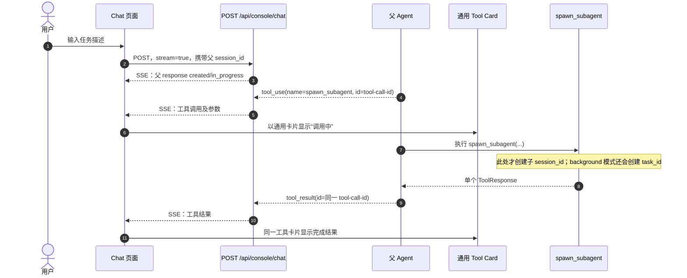
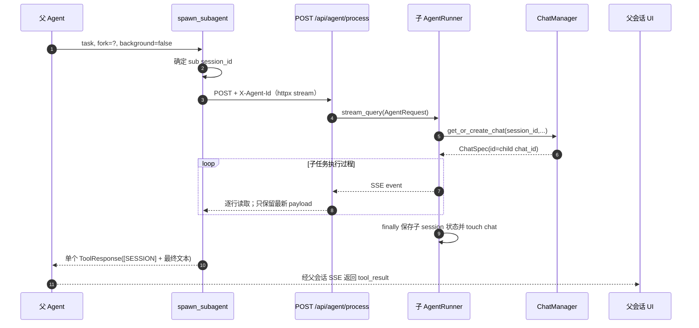
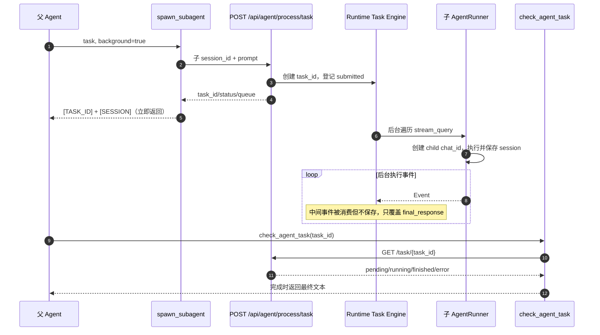
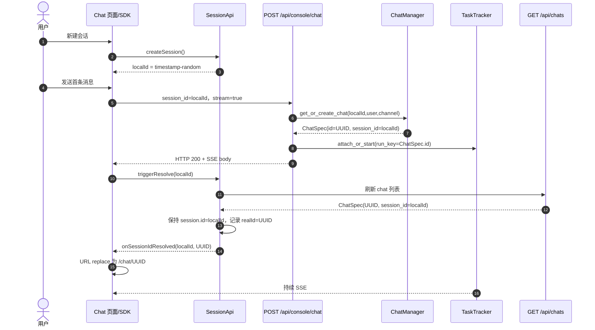
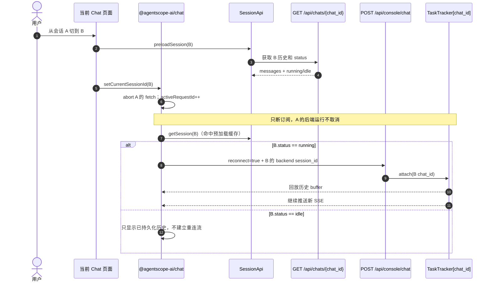

# QwenPaw v1.1.12.post2：`spawn_subagent` 与普通会话 SSE 机制

本文基于分支 `codex/v1.1.12.post2`、提交 `ec4b7d3973e0fee28ec0918b7cc670d69e7b90f2` 的现有代码整理；项目依赖为 `agentscope==1.0.20`、`agentscope-runtime==1.1.6`，前端实际锁定 `@agentscope-ai/chat==1.1.68`。

文中的“前端”指 `console/` React 页面，“后端”同时包含 QwenPaw FastAPI 代码和它挂载的 AgentScope Runtime `AgentApp` 路由。当前实现中，`spawn_subagent` 并没有专用的子会话 Tab、专用 Tool Card 或面向前端的子会话 SSE；这些是理解现状和后续设计时最重要的边界。

为避免混淆，先区分全文涉及的标识：

| 标识 | 生成方 | 典型格式 | 作用域与用途 |
| --- | --- | --- | --- |
| 工具调用 ID（tool call id） | 模型 API，经 AgentScope `ToolUseBlock.id` 透传 | 由模型供应商决定 | 关联父会话里的 `spawn_subagent` 工具调用与工具结果；不是后台任务 ID |
| `task_id` | AgentScope Runtime 后台任务接口 | UUID | 仅在 `background=True` 时生成，用于 `check_agent_task` 轮询 |
| 子会话 `session_id` | QwenPaw `spawn_subagent` 或 fork API | `sub-` + 8 位 UUID 前缀 | Agent 记忆、状态文件及 ChatSpec 查找的会话键 |
| `chat_id` / `ChatSpec.id` | QwenPaw `ChatSpec` | UUID | 会话列表、历史接口、普通 SSE `TaskTracker` 的运行键 |
| 前端临时会话 ID | `SessionApi.createSession` | `<毫秒时间戳>-<7位随机串>` | 新普通会话首条消息前的 UI/SDK 标识 |
| 前端 `realId` | 由 `/chats` 返回结果解析 | 与 `chat_id` 相同 | 保留临时 UI ID 时，额外记录真实后端 UUID |

> 结论：当前代码中不存在“前端先为 `spawn_subagent` 创建一个后台 `task_id`”的步骤。前端首先看到的是模型产生的工具调用 ID；只有工具参数为 `background=True` 时，后端才会另行创建 `task_id`。这两个 ID 彼此独立。

---

# 第一章：`spawn_subagent` 的前后端调用与子会话机制

## 1.1 从父会话到工具调用标识

用户在普通 Chat 页面发送消息后，父会话通过 `/api/console/chat` 返回 SSE。模型若决定调用 `spawn_subagent`，模型适配器把供应商返回的工具调用标识写入 `ToolUseBlock.id`；AgentScope Runtime 再把它转换为带 `call_id` 的 `plugin_call` SSE 消息。工具执行结果使用同一个 `ToolResultBlock.id`，因此父会话能够把调用和结果配成一组。

QwenPaw 前端没有直接调用 `spawn_subagent` API，也没有为它注册专用卡片：

- `console/src/components/Chat/ToolCards/cards/index.ts:78` 的内置表里没有 `spawn_subagent`。
- `console/src/pages/Chat/index.tsx:2720` 使用 `withGenericFallback(...)`，所以该工具落到 `GenericToolCard`。
- `console/src/components/Chat/ToolCards/adapters/v1Adapter.tsx:68` 从工具调用消息提取名称、参数和结果。
- 前端卡片 `toolId` 的优先级为 `callData.id`、消息 `data.id`、最后才是本地合成 ID，见 `v1Adapter.tsx:110`。它只服务于父会话卡片渲染，不会自动绑定子会话。

父会话侧的时序如下：



## 1.2 子 `session_id`、`chat_id` 和运行路由

工具入口是 `src/qwenpaw/agents/tools/agent_management.py:647` 的 `spawn_subagent`。

### 1.2.1 非 fork 路径

1. `_generate_subagent_session_id()`（`agent_management.py:642`）先生成 `sub-xxxxxxxx`。
2. 构造新的 AgentRequest，只包含子 `session_id`、一条用户消息和空的 `request_context`。
3. 请求头 `X-Agent-Id` 仍是当前 Agent，所以子任务使用同一个持久 Agent 配置和 Workspace，但使用独立会话状态。
4. 前台模式 POST `/api/agent/process`；后台模式 POST `/api/agent/process/task`。
5. `AgentRunner.query_handler`（`src/qwenpaw/app/runner/runner.py:417`）开始执行时调用 `ChatManager.get_or_create_chat`（`runner.py:805`、`manager.py:80`）。如果该 `session_id + user_id + channel` 尚无记录，`ChatSpec` 自动生成 UUID `id`，它就是子会话的 `chat_id`。

非 fork 请求没有显式传 `user_id` 和 `channel`。AgentScope Runtime 会在 `user_id` 为空时令其等于 `session_id`，QwenPaw 则使用默认频道 `console`。因此该路径通常形成：

```text
session_id = sub-xxxxxxxx
user_id    = sub-xxxxxxxx
channel    = console
chat_id    = <ChatSpec 自动生成的 UUID>
```

### 1.2.2 fork 路径

`fork=True` 会先进入 `agent_management.py:821` 的 `_spawn_forked_subagent`：

1. 从当前执行上下文取得父 `session_id`、`user_id`、`channel`。
2. `_call_fork_api`（`agent_management.py:749`）POST `/api/fork/agent`。
3. `src/qwenpaw/app/routers/fork.py:277` 读取父会话状态，生成一个新的 `sub-xxxxxxxx`，把父状态写入新 session 文件。
4. 若当前项目或 Workspace 是 Git 仓库，再创建 `.qwenpaw/worktrees/<id>` 和 `fork/<id>` 分支。
5. fork API 返回的 `fork_session_id` 是实际使用的子 `session_id`。它通常不是工具入口最初预生成的那个 ID；最初 ID 只在 fork 响应缺失 `fork_session_id` 时作为兜底。
6. 随后仍按前台或后台模式请求 `/api/agent/process` 或 `/api/agent/process/task`，Runner 再为这个 fork session 建立 `ChatSpec.id`。

fork 只改变“是否继承父状态、是否使用隔离 worktree”，不改变前端输出协议。

## 1.3 前台模式：内部流式、外部一次性工具结果

`background=False` 时，`collect_final_agent_chat_response`（`agent_management.py:283`）使用 `httpx.Client.stream` 请求 `/api/agent/process`。该接口本身是 SSE，子 Agent 的 reasoning、文本、工具调用等执行事件都会经过这条内部连接。

但收集函数只不断覆盖 `response_data`，最终仅保留最后一个可解析的 SSE payload。`spawn_subagent` 等待整个子任务结束后，才用 `format_agent_chat_text` 生成一个普通 `ToolResponse`：

```text
[SESSION: sub-xxxxxxxx]

<子 Agent 最终文本>
```

因此需要区分两层“流式”：

- 子 Agent → `spawn_subagent` 工具函数：是内部 SSE。
- `spawn_subagent` → 父 Agent/前端：不是子执行过程流，而是完成后的单个工具结果。
- 父会话自身仍通过 `/console/chat` 流式发送“工具开始”“工具完成”等父会话事件，所以用户会看到卡片状态变化，但看不到子 Agent 的逐条过程。



父页面断开自己的 SSE 时，QwenPaw 普通会话 `TaskTracker` 只移除该前端订阅者，父 Agent 仍在后台运行；父 Agent 内部等待子 SSE 的 HTTP 调用也会继续。换句话说，父页面切换不会自动取消正在执行的前台 subagent。

## 1.4 后台模式：返回 `task_id`，轮询最终结果

`background=True` 时，`submit_agent_chat_task`（`agent_management.py:308`）调用 `/api/agent/process/task`。QwenPaw 在 `src/qwenpaw/app/_app.py:212` 创建 `AgentApp` 时启用了 `enable_stream_task=True`；实际任务接口由 `agentscope-runtime==1.1.6` 的 `AgentApp._add_stream_query_task_endpoint` 提供。

内存模式下，该接口：

1. 使用 `uuid.uuid4()` 生成 `task_id`。
2. 在 `active_tasks[task_id]` 中记录 `submitted` 状态。
3. 用 `asyncio.create_task` 执行 Runner 的流生成器。
4. 内部仍遍历全部流事件，但 `execute_stream_query_task` 只保存最后一个响应事件，不保留中间事件。
5. 立即向 `spawn_subagent` 返回 JSON；工具再把它格式化为：

```text
[TASK_ID: <uuid>]
[SESSION: sub-xxxxxxxx]

Task submitted successfully.
Check status with: check_agent_task(task_id='<uuid>')
```

`check_agent_task`（`agent_management.py:604`）GET `/api/agent/process/task/{task_id}`，得到 `pending`、`running`、`finished` 或 `error`。完成后才从保存的最终 AgentResponse 中提取子 Agent 最终文本。



`spawn_subagent(timeout=...)` 的 `timeout` 参数是前台等待超时。当前后台分支没有把该参数作为单任务 timeout 传给提交函数，因此后台执行采用 AgentApp 配置的 `stream_task_timeout=1800` 秒；提交 HTTP 请求本身使用较短的客户端超时。

## 1.5 四种组合模式对照

| `fork` | `background` | 子上下文 | 子执行传输 | 父工具何时完成 | 父前端可见内容 |
| --- | --- | --- | --- | --- | --- |
| `False` | `False` | 空白独立 session，同 Agent/Workspace | 内部 `/agent/process` SSE | 子任务完整结束后 | 工具调用状态 + 最终文本；无子过程流 |
| `True` | `False` | 复制父 session；Git 条件满足时隔离 worktree | 内部 `/agent/process` SSE | 子任务完整结束并处理 worktree 后 | `[SESSION]`、最终文本，必要时 `[FORK_BRANCH]`；无子过程流 |
| `False` | `True` | 空白独立 session，同 Agent/Workspace | `/agent/process/task` 后台遍历流，只保存最终事件 | task 提交成功后立即完成 | `[TASK_ID]`、`[SESSION]`；后续靠 `check_agent_task` |
| `True` | `True` | 复制父 session；可隔离 worktree | 同上 | task 提交成功后立即完成 | 再附加 `[FORK_BRANCH]`；后台模式不自动清理 worktree |

所有请求的 AgentRequest 默认 `stream=True`，而 `/agent/process` 本身也固定返回 `text/event-stream`。这里的差异不是“子 Agent 是否产生流”，而是“这些流事件是否被直接暴露给父前端”：当前四种模式都没有把子过程 SSE 透传到独立子会话页面。

## 1.6 `session_id` 与 `chat_id` 如何到达前端

当前工具输出明确包含子 `session_id`，后台模式还包含 `task_id`，但没有返回 `chat_id`：

- `chat_id` 在 `AgentRunner.query_handler` 内部创建，晚于工具构造子请求。
- `/agent/process` 最终 AgentResponse 有 `session_id`，没有 `ChatSpec.id` 字段。
- `format_agent_chat_text` 使用调用方已知的子 `session_id`，不解析或补充 `chat_id`。
- 前端 Generic Tool Card 只显示工具结果文本，不解析 `[SESSION: ...]` 来创建子 Tab。

子 ChatSpec 会写入同一 Agent 的 chat registry，普通 `/api/chats` 列表因没有过滤 `sub-` 或专用 source，可能把它当作普通 chat 返回。若要从现有接口反查，只能在同一 Agent 作用域中查询 `/api/chats`，按 `ChatSpec.session_id == 子 session_id` 找到对应 `ChatSpec.id`；该映射当前没有作为 `spawn_subagent` 的正式响应契约。

而且子 `chat_id` 目前不是子任务的活动运行键。`/agent/process` 经过 `DynamicMultiAgentRunner.stream_query` 时，只用随机的 `ext-<UUID>` 向 Workspace `TaskTracker` 登记，以便 Agent 重载时能看见未完成任务；它没有把该运行改挂到子 `ChatSpec.id`。因此子任务执行期间，`GET /api/chats/{child_chat_id}` 仍可能报告 `status=idle`，普通会话的 `reconnect=true -> TaskTracker.attach(chat.id)` 也无法接入这条子流。

## 1.7 本章现状结论

当前已有能力是：父会话能显示 `spawn_subagent` 通用工具卡片；四种执行组合都能建立独立子 session 和 ChatSpec；前台等待最终结果，后台返回任务句柄并支持轮询。

当前没有的能力是：

- 没有 `spawn_subagent` 专用 Tool Card 和“工具调用 ID → 子 session/chat”绑定结构。
- 没有在工具结果中直接返回 `chat_id`。
- 没有子会话 Tab。
- 没有把子 Agent 中间事件流转发给浏览器。
- 子 `chat_id` 没有绑定子任务的活动 stream；普通 chat 状态查询和 reconnect 不能直接复用。
- 后台 task engine 只保存最终事件，不具备普通会话 `TaskTracker` 的事件回放与订阅重连能力。

---

# 第二章：普通会话的前后端 SSE、会话 ID 转换与切换重连

## 2.1 普通会话的三层 ID

普通 Chat 页面同时维护三个不同概念：

| 层次 | 前端字段 | 后端字段 | 说明 |
| --- | --- | --- | --- |
| UI/SDK 当前项 | `session.id` / `currentSessionId` | 无直接对应 | 新会话时是临时时间戳 ID；已存在会话通常是 UUID |
| Agent 状态键 | `session.sessionId` | `ChatSpec.session_id`、AgentRequest `session_id` | 决定加载/保存哪份 Agent session 状态 |
| Chat 资源与运行键 | `session.realId` 或后端会话的 `session.id` | `ChatSpec.id` | `/chats/{id}`、停止接口和 `TaskTracker.run_key` 使用的 UUID |

后端类型也明确区分了二者：`console/src/api/types/chat.ts:4-5` 中 `id` 是 Chat UUID，`session_id` 是会话标识。

## 2.2 新普通会话首条消息：临时 ID 转真实 UUID

前端新建空白会话时并不先 POST `/chats`。`SessionApi.createSession` 只创建 `<timestamp>-<random>` 临时 ID，并把它写入 SDK `currentSessionId`、`window.currentSessionId` 和本地 session list。首条消息提交后才由聊天接口隐式创建后端 ChatSpec。



关键代码：

- `console/src/pages/Chat/sessionApi/index.ts:312`：`resolveRealId` 按 `ChatSpec.session_id == tempId` 找真实 UUID。
- `console/src/pages/Chat/index.tsx:2093`：`customFetch` 构建并发送普通会话请求。
- `console/src/pages/Chat/index.tsx:2193`：POST 成功后触发异步 ID 解析，不阻塞 SSE。
- `console/src/pages/Chat/index.tsx:1918`：`onSessionIdResolved` 更新 URL。

保留临时 `session.id`、另存 `realId` 是为了不在流式响应过程中突然替换 SDK 的 `currentSessionId`；URL 则尽快换成稳定的后端 UUID，方便刷新和直接访问。

## 2.3 后端 `/console/chat` 如何产生可重连 SSE

入口是 `src/qwenpaw/app/routers/console.py:142`：

1. `_extract_session_and_payload`（`console.py:72`）提取 `channel`、`user_id`、`session_id` 和当前用户输入。
2. `ConsoleChannel.resolve_session_id` 优先使用请求明确传入的 `session_id`，否则才回退为 `console:<sender_id>`。
3. `ChatManager.get_or_create_chat` 将 `session_id + user_id + channel` 解析为 `ChatSpec`，新会话会生成 UUID `chat.id`。
4. 普通请求调用 `TaskTracker.attach_or_start(chat.id, payload, console_channel.stream_one)`。
5. `TaskTracker` 创建一个与 HTTP 消费者解耦的后台 producer；producer 遍历 `ConsoleChannel.stream_one`，把每个 SSE 字符串加入内存 `buffer`，并广播到每个订阅队列。
6. 当前 HTTP 响应只消费自己的队列。客户端断开时，`stream_from_queue` 的 `finally` 调用 `detach_subscriber`，不会取消 producer。
7. producer 完成时向所有队列写入 sentinel，并从 `_runs` 删除该 `chat.id`。

`ConsoleChannel.stream_one`（`src/qwenpaw/app/channels/console/channel.py:366`）把 Runner Event 序列化成：

```text
data: <JSON event>\n\n
```

事件包括 response/message 的 created、in_progress、completed，文本/思考增量和工具调用/结果等。Agent 完成后还会在保存 token 用量后追加一条 `type=turn_usage` 的 SSE；前端消费它用于用量 UI，但不会把它交给普通消息构建器。

`StreamingResponse` 设置 `media_type="text/event-stream"`、`Cache-Control: no-cache`、`Connection: keep-alive`。这里虽然通常称为 SSE，但因为请求需要 POST body，浏览器端使用的不是原生 `EventSource`。

## 2.4 前端如何绑定和解析 SSE

`customFetch` 的主要步骤是：

1. 从 `SessionApi.getSessionIdentity()` 取得权威的后端 `session_id`、`user_id`、`channel`；优先依据 `lastActiveChatId` 找 session list，避免全局变量在快速切换时过期。
2. 只发送最后一条输入，设置 `stream: true`。
3. 将当前用户消息暂存在 `sessionStorage`。Runner 的 session 状态在本轮完成时才保存，因此重连期间后端历史可能尚无这条用户消息，前端需要补齐。
4. `fetch('/api/console/chat', {method:'POST', signal})` 获得 `Response.body`。
5. `@agentscope-ai/chat` 的 `Stream` 逐个解析 `data:` 块；`responseParser` JSON 反序列化后交给 `AgentScopeRuntimeResponseBuilder` 合并增量。
6. SDK 用 `activeRequestId + activeSessionId` 双重校验，旧请求或旧会话的残余 chunk 不得写入当前页面。

因此前后端关联关系不是“URL UUID 直接作为 SSE key”，而是：

```text
前端 currentSessionId
  -> SessionApi.getBackendSessionId(...)
  -> POST body.session_id
  -> ChatManager 查到 ChatSpec.id
  -> TaskTracker[ChatSpec.id]
  -> 当前 fetch 的订阅队列
```

## 2.5 会话页面切换：断开旧订阅、按状态连接新会话

会话点击流程有两层协调：

- QwenPaw `ChatSessionInitializer`（`console/src/pages/Chat/components/ChatSessionInitializer/index.tsx:34`）负责 URL 与 SDK `currentSessionId` 的双向同步，并按 `id`、`realId`、`sessionId` 三种形式匹配。
- `SessionApi.preloadSession` 在真正切换前先 GET `/api/chats/{chat_id}`，把结果短暂缓存，避免 SDK 随后的自动加载重复请求。

目标历史接口返回 `status`：`src/qwenpaw/app/runner/api.py:135` 使用 `TaskTracker.get_status(chat_id)` 判断 `idle/running`。`SessionApi.fetchAndBuildSession`（`sessionApi/index.ts:874`）把 `status == running` 转成 `session.generating=true`。

SDK 当前会话发生真实变化时：

1. 旧 SSE 的 `AbortController.abort()` 被调用。
2. `activeRequestId` 自增，旧流即使仍有残余数据也会被丢弃。
3. 不调用后端 cancel，因此旧会话的 producer 和 Agent 继续执行。
4. Session Loader 清空页面消息，加载目标会话历史。
5. 若目标 `generating=true`，SDK 发出 `handleReconnect`。
6. QwenPaw 的 `api.reconnect`（`console/src/pages/Chat/index.tsx:2698`）再次 POST `/api/console/chat`，携带 `reconnect=true`，并用 `SessionApi.getBackendSessionId(data.session_id)` 把 SDK ID 转回后端 `session_id`。
7. 后端用同一组 `session_id + user_id + channel` 找到 ChatSpec，再以 `chat.id` 调用 `TaskTracker.attach(chat.id)`。
8. `attach` 先把该运行自开始以来的完整 buffer 放入新队列，然后继续接收新事件。



若 `reconnect=true` 时对应运行已经完成，`TaskTracker.attach` 返回空；当前后端直接结束该请求。SDK 若没有收到完成事件，会移除为重连创建的空响应占位并恢复非 loading 状态，后续以已持久化历史为准。

## 2.6 “断连”不等于“停止”

普通会话有两种不同操作：

| 操作 | 前端行为 | 后端行为 |
| --- | --- | --- |
| 切换会话造成断连 | abort 当前 fetch，不调 cancel | `detach_subscriber`；Agent 和 producer 继续，buffer 继续增长 |
| 用户点击停止 | 调 `/api/console/chat/stop?chat_id=<UUID>`，再 abort fetch | `TaskTracker.request_stop(chat_id)` 取消 producer；接口还兼容把传入值当 `session_id` 反查 UUID |

这种区分保证用户只是查看另一会话时不会误杀正在生成的任务。重新切回后，页面可通过 `running` 状态触发重连。

## 2.7 重连能力的准确边界

现有普通会话重连具有以下特性：

- 支持同一个运行的多个订阅者；每次连接有独立队列。
- 重连不是基于 SSE `Last-Event-ID` 或序号续传，而是从内存 buffer 开头完整回放，再继续接收新事件。
- 重连通常由“加载到 `status=running` 的会话”触发，例如切走再切回、刷新后重新加载该会话；当前 SDK 没有对同一连接的任意网络错误实现自动退避重试循环。
- buffer 只存在于当前进程内，服务重启或 Agent Workspace 重载后不能恢复。
- producer 完成即删除 `_runs[chat_id]` 和 buffer；完成后的恢复依赖 session 状态文件和 `/chats/{chat_id}` 历史，不再依赖 SSE 回放。
- 当前 buffer 和每个订阅队列没有显式容量上限，长时间高频事件会增加内存占用。
- 代码中可以明确确认的主动断连路径是“SDK `currentSessionId` 发生真实切换”；它不等同于一个通用的服务端 disconnect API。

## 2.8 两套机制为何不能直接等同

普通会话和 `spawn_subagent` 虽然最终都经过 `AgentRunner.stream_query`，但外层运行管理不同：

| 项目 | 普通 `/console/chat` | `spawn_subagent` 前台 | `spawn_subagent` 后台 |
| --- | --- | --- | --- |
| 浏览器是否直接消费流 | 是 | 否，由后端 httpx 消费 | 否 |
| 外层运行键 | `ChatSpec.id` | Runtime 内部 `ext-UUID` 仅用于优雅停机可见性 | Runtime `task_id` |
| 中间事件保存 | `TaskTracker.buffer` 全量保存到完成 | `collect_final...` 只保留最后 payload | Task Engine 只保存最后 event |
| 断开后运行继续 | 是 | 父 TaskTracker 继续，所以子调用继续 | 天然后台继续 |
| 可按 chat 重连回放 | 是，运行期间可用 | 否 | 否，只能轮询状态 |
| 前端会话 ID 绑定 | `SessionApi` 已实现 | 未实现 | 未实现 |

所以后续若要为 subagent 增加“子 Tab 实时输出、断连重连”，不能只把现有 `/agent/process` 响应地址交给前端；至少还需要建立稳定的“父工具调用 ID / `task_id` → 子 `session_id` → 子 `chat_id` → 可订阅运行键”映射，并为子运行引入与普通 `TaskTracker` 等价的事件缓存和订阅生命周期。当前代码已经提供普通会话的参考实现，但尚未把这套能力接到 `spawn_subagent` 上。

## 2.9 主要代码索引

| 范围 | 文件与入口 |
| --- | --- |
| `spawn_subagent` 工具及模式分支 | `src/qwenpaw/agents/tools/agent_management.py:647` |
| fork session/worktree | `src/qwenpaw/app/routers/fork.py:277` |
| 子/普通 ChatSpec 自动创建 | `src/qwenpaw/app/runner/runner.py:417`、`src/qwenpaw/app/runner/manager.py:80` |
| AgentApp 挂载与后台任务配置 | `src/qwenpaw/app/_app.py:75`、`src/qwenpaw/app/_app.py:212`、`src/qwenpaw/app/_app.py:711` |
| 普通会话 SSE 路由 | `src/qwenpaw/app/routers/console.py:142` |
| 普通 SSE 事件序列化 | `src/qwenpaw/app/channels/console/channel.py:366` |
| 运行缓存、订阅与停止 | `src/qwenpaw/app/runner/task_tracker.py:37` |
| Chat 列表、历史和运行状态 | `src/qwenpaw/app/runner/api.py:66`、`src/qwenpaw/app/runner/api.py:135` |
| 前端普通会话请求与 reconnect | `console/src/pages/Chat/index.tsx:2093`、`console/src/pages/Chat/index.tsx:2698` |
| 前端 ID 解析和历史加载 | `console/src/pages/Chat/sessionApi/index.ts:312`、`console/src/pages/Chat/sessionApi/index.ts:874` |
| URL/SDK 会话同步 | `console/src/pages/Chat/components/ChatSessionInitializer/index.tsx:34` |
| `spawn_subagent` 通用 Tool Card 兜底 | `console/src/components/Chat/ToolCards/adapters/v1Adapter.tsx:68`、`:189` |
